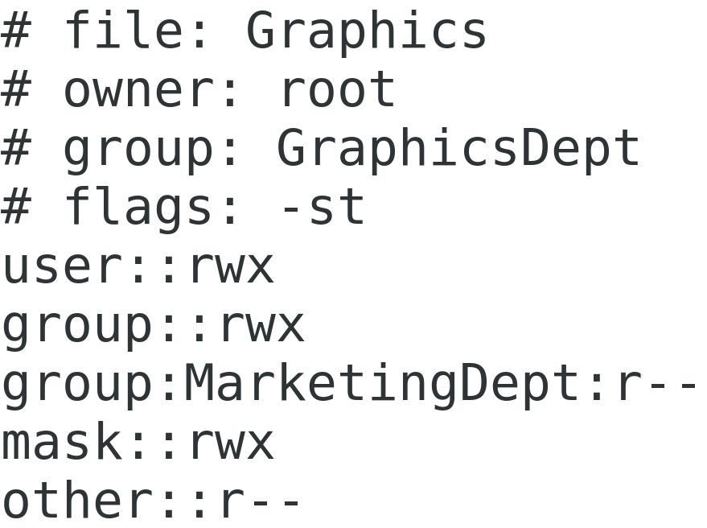

# 03: Managing Permissions and Ownership

Modifying File and Directory Permissions
Scenario

You're concerned about how to protect files and directories on a Linux server. You will interpret the existing permissions of a few files, and then configure permissions for the file owner, the group, and all others for files and directories.
Objectives

Completing this activity will help you to use content examples from the following syllabus objectives:
    3.1 Given a scenario, apply or acquire the appropriate user and/or group permissions and ownership

1. Configuring permissions
   + Log in as student01 with Pa22w0rd as the password.
   + Enter ls -l to see the permissions string for files and directories in the student01 home directory.
   + Review the permissions assigned, identifying which bits are configured for the owner, the group, and all others.
   + Enter ls -l /etc/ssh/sshd_config to view the permissions for this configuration file.
   + Write down the permissions for the owner, group, and others.
   + Owner:
   + Group:
   + Other:
   + Enter ls -l /var/log/cron to view the permissions for this log file.
   + Write down the permissions for the owner, group, and others.
   + Owner:
   + Group:
   + Other:

1. Create a test directory and file you can configure the permissions for
   + Enter `mkdir permissions-demo` to create a directory in the `student01` home directory.
   + Enter `cd permissions-demo` to change to that directory.
   + Enter `mkdir DirA to create a permissions demonstration directory named DirA.
   + Enter `touch file1 to create a permissions demonstration file named file1.
   + Enter `ls -l to display the current permissions on both objects.

1. Configure permissions for the test directory and file using absolute mode.
   + Enter `chmod 755 DirA` to set permissions on DirA.
   + Enter `ls -l` to see how the permissions have changed on the directory.
   + Enter `chmod 660 file1` to set permissions on file1.
   + Enter `ls -l` to see how the permissions have changed on file1.
   + Enter `chmod 750 DirA` to set different permissions on DirA.
   + Enter `ls -l` to see how the permissions have changed on DirA.
   + Enter `chmod 744 file1` to configure permissions on file1.
   + Enter `ls -l` and note the permissions changes.

1. Configure permissions for the test directory and file using symbolic mode.
   + Enter chmod o+r DirA to set permissions on DirA.
   + Enter ls -l to see how the permissions have changed on DirA.
   + Enter chmod go+rw file1 to set different permissions on file1.
   + Enter ls -l to see how the permissions have changed on file1.
   + Enter chmod go-rwx DirA to set permissions on DirA.
   + Enter ls -l and note the permissions changes on DirA.
   + Enter chmod go-w file1 to set permissions on file1.
   + Enter ls -l and note the permissions changes on file1.
   + The final permissions state of the directory should be: drwx------
   + The final permissions state of the file should be: -rwxr--r--

## Modifying Default Permissions

> Scenario

```task
One of the Develetech employees, Chris Mason, wants to create files and directories with nondefault permissions so he can share them more easily with a co-worker. Since the requested change does not violate the Develetech security policy, it has been approved. You will implement the change for Chris.
```


> Objectives

Completing this activity will help you to use content examples from the following syllabus objectives:
    3.1 Given a scenario, apply or acquire the appropriate user and/or group permissions and ownership

1. Display the current default permissions settings for users that create new files and directories.
   + Enter umask to display the default umask value that defines default permissions for newly-created files and directories.
   + Verify that the default mask is 0002
   + For standard users, no advanced permissions are set by default (the first 0), owner and group permissions aren't masked, and other user permissions are masked by 2

1. Configure Chris Mason's .bashrc file with a non-standard umask value.
   + Enter sudo vim /home/cmason/.bashrc to open the file in a text editor.
   + Press Page Down to move the cursor to the bottom of the file.
   + Press i to enter Insert mode.
   + Add the following text on a new line:
   + umask 022
   + Press Esc to exit Insert mode.
   + Enter :wq to save and close the file.

1. Test the new default permissions.
   + Enter su - cmason to switch credentials.
   + Enter Pa22w0rd when prompted.
   + Enter umask to view the current permissions default.
   + You should see the 0022 value that was configured in the steps above.
   + Enter touch test-file to create a new file named test-file.
   + Enter ls -l and verify that the permissions for test-file match the newly configured umask value.
   + The permissions should be: -rw-r--r--
   + Enter exit to return to your student account.

## Modifying File and Directory Ownership

> Scenario
```task
You will create a Graphics department directory where department members can store content. You will investigate default ownership and group associations, and then create the /Graphics directory. You will configure ownership and group associations of the directory and files.
```
> Objectives

+ Completing this activity will help you to use content examples from the following syllabus objectives:
   + 3.1 Given a scenario, apply or acquire the appropriate user and/or group permissions and ownership

1. Display the current ownership and group associations for files and directories
   + Enter ls -l /var/log/cron to view ownership and group details about the cron log file.
   + The root user is the owner, and the root group is the group.
   + Enter ls -l /etc/ssh/sshd_config to view ownership and group details about th sshd configuration file.
   + The root user is the owner, and the root group is the group.
   + Enter sudo ls -l /home/cmason to view ownership and group details about the contents of cmason's home directory.
   + The cmason user is the owner, and the cmason group is the group.

1. Create a directory and populate the directory with files, then manage the ownership values.
   + Enter sudo mkdir /Graphics to create a directory named Graphics at the root of the file system.
   + Enter sudo touch /Graphics/file1 to create a file named file1 in the Graphics directory.
   + Repeat this command with file2 and file3 to create two additional empty files inside the directory.
   + Enter ls -l /Graphics to display the ownership information.
   + The owner is the creator; in this case that is the root account, due to the use of the sudo command.
   + Enter sudo chmod -R 774 /Graphics to set permissions on the /Graphics directory and its contents.
   + Enter sudo ls -l /Graphics to view the new permissions.
   + jhvjvqzy.jpg

1. Change the owner and group values of the /Graphics directory and its contents
   + Enter sudo chown -R :GraphicsDept /Graphics to set the group association as the GraphicsDept group.
   + Enter sudo ls -ld /Graphics to display the changes.
   + Enter sudo chown rstanley /Graphics/file2 to change the ownership of file2 to Rose Stanley.
   + Enter sudo ls -l /Graphics to confirm rstanley is now the owner of file2.

## Configuring SGID Permissions and Sticky Bits

> Scenario
```task
Some users have noted that the group associations for /Graphics are not applied to files created in the directory. One user also complained that another user accidentally deleted one of her files. You are asked to correct these concerns.
```
Objectives

Completing this activity will help you to use content examples from the following syllabus objectives:
    3.1 Given a scenario, apply or acquire the appropriate user and/or group permissions and ownership

1. Use SGID to automatically set group associations for newly created files in the /Graphics directory
   + Enter ls -ld /Graphics to see the default permissions on the /Graphics directory.
   + Enter sudo chmod g+s /Graphics to set the SGID on /Graphics so that newly created files will get the group association.
   + Enter ls -ld /Graphics to display the new permissions.
   + Enter su - rstanley and enter Pa22w0rd to switch to Rose Stanley's credentials.
   + Enter cd /Graphics and then touch file4 to create a file named file4.
   + Enter ls -l and confirm rstanley is the owner and the group is GraphicsDept for file4.
   + Enter exit to return to the student01 login.

1. Use the sticky bit to better protect files from deletion by anyone but their owner
   + Enter sudo chmod +t /Graphics to configure the sticky bit on the /Graphics directory.
   + Enter su - jrobinson and enter Pa22w0rd to switch to Jerry Robinson's credentials.
   + Enter cd /Graphics to move to the /Graphics directory.
   + Enter rm file4 to attempt to delete file4, which is owned by rstanley.
   + Note that you receive an "Operation not permitted" response. If this were a permissions issue, you would receive an "access denied" response instead. Even though jrobinson is a member of the GraphicsDept group, and that group has the permissions to delete a file in this directory, the sticky bit is preventing file deletion from a non-owner.
   + Enter exit to return to the student01 login.

## Setting the Immutable Flag on a File

> Scenario
```task
You have written a README text file to be stored in the /Graphics directory to help guide users on the proper use of the content. You want to ensure that no one, not even the root user, can accidentally delete the file. You will use the immutable attribute to accomplish this task.
```
Objectives

Completing this activity will help you to use content examples from the following syllabus objectives:
    3.1 Given a scenario, apply or acquire the appropriate user and/or group permissions and ownership

1. Configure the immutable flag
   + Enter sudo touch /Graphics/README to create a document in the /Graphics directory.
   + Enter sudo ls –l /Graphics to view the current permissions settings for the README file.

1. Verify the README file is owned by root, and that the owner would normally be able to delete the file
   + Enter sudo chattr +i /Graphics/README to set the immutable attribute on the README file.
   + Enter sudo ls -l /Graphics to view the current permissions and verify that they have not changed.
   + Enter sudo lsattr /Graphics/README to confirm the immutable attribute is set.

1. Verify that the flag works by attempting to delete the file.
   + Enter sudo rm /Graphics/README to attempt to delete the README file from the /Graphics directory.
   + Verify that this fails.
   + This is due to the immutable attribute. Note the "Operation not permitted" response rather than the "access denied" response that indicates a permissions issue.

## Configuring ACLs

> Scenario

```text
The Graphics department has requested that the Marketing department be given read-only access to the /Graphics directory. With standard permissions, only one group association can exist. You will use access control lists (ACLs) to ensure that both the Graphics and Marketing departments have access.
```

> Objectives

+ Completing this activity will help you to use content examples from the following syllabus objectives:
  + 3.1 Given a scenario, apply or acquire the appropriate user and/or group permissions and ownership

1. Set an ACL for the Marketing department.
   + Enter sudo getfacl /Graphics to view the current ACL on the Graphics directory.
   + Enter sudo setfacl -R -m g:MarketingDept:r /Graphics to grant read-only permissions to the MarketingDept to the /Graphics directory and its contents.
       + You can ignore the "Operation not permitted" warning about the README file; the ACL settings will still apply to all other objects.
   + Enter sudo getfacl /Graphics to view the new level of access for the MarketingDept.
   + 

