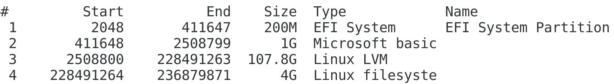
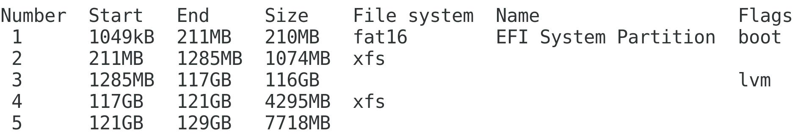
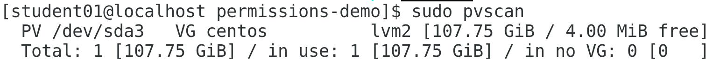

# 04: Managing Storage

## Creating Partitions

> Scenario

```plaintext
Develetech is concerned about losing data in the event of storage drive corruption. You'll create a couple of partitions where the team can store backups for the time being. In the event that the main storage partition fails, these backups may remain unaffected and can be used for recovery. So, you'll create two new partitions:
```

- A partitions that will hold system data in an `XFS file system`.
- A partition that will hold critical business files and other user data in an `ext4` file system.

You'll just create the partitions for now; you'll make them available for use later.

> Objectives

```text
Completing this activity will help you to use content examples from the following syllabus objectives:
    1.4 Given a scenario, manage storage in a Linux environment.
    2.3 Given a scenario, create, modify, and redirect files.
    4.1 Given a scenario, analyze system properties and remediate accordingly.
    4.4 Given a scenario, analyze and troubleshoot application and hardware issues.
```

1. Create the first new logical partition.

   - Log in as `student01` with `Pa22w0rd` as the password.
   - Enter `sudo fdisk /dev/sda` to begin partitioning the main drive.
   - If your computer has multiple physical drives, they will likely be named /dev/sdb, /dev/sdc, etc.
   - Enter `m` to display the command menu options.
   - Enter `p` to print the partition table.
   - Enter `n` to begin creating a new partition.
   - Press `Enter` to accept the default partition number.
   - Several partitions were automatically created during the installation of CentOS, so this is the next available partition number.
   - Enter this partition number in the text box below. This value will be incorporated within commands that you will use later in the lab.
   - First partition number:
   - Press `Enter` to accept the default first sector.
   - This is the first part of the drive that currently has no partition (i.e., free space).
   - Enter `+4096M` and then press `Enter` to create a partition 4 GB in size.
   - Enter `p` to print the partition table.
   - Verify that the new partition was created.
   - 
   - Enter `w` to write (save) your changes to the partition table and exit.
     - You can ignore the warning; you'll handle this in the next step.
   - Enter `sudo partprobe` to update the Linux kernel with the partition table changes.

1. Create an XFS file system on the new partition.

   - Enter `sudo mkfs.xfs /dev/sda`<_partitionnumber_> (the value at the end of the command is the number of the partition you entered in the "First partition number" text box).
   - If there is an error, check that you have entered the correct value in the "First partition Number" text box.

1. Create the second new partition with an `ext4` file system.

   - Enter `sudo parted /dev/sda` to launch the parted utility.
   - Enter `print` to display the list of partitions on this device.
   - Enter `mkpart` to start the partition creation process.
   - Press `Enter` to select a blank name for now.
   - Enter `ext4` as the file system type.
     - This associates the partition with the `ext4` file system type; it doesn't actually format the partition with an `ext4` file system.
   - Examine the list of partitions you just printed and identify the End value for the last partition (i.e., the `XFS` partition you created with `fdisk`).
   - Enter this value at the `Start?` prompt.
   - For example, if the end value is `121GB`, then enter `121GB` at the prompt.
   - At the `End?` prompt, add `8 GB` to the start value and enter that.
   - For example, if the end value is `121GB`, then you'd enter `129GB` at the prompt.
   - Enter print and verify that both of your new partitions appear.
   - 
   - Enter the partition number for the partition you just created in the text box below. You'll need to reference the number later.
   - Second partition number:
   - Enter `q` to quit `GNU Parted`.

1. Create an `ext4` file system on the new partition

   - Enter `sudo mkfs.ext4 /dev/sda<partition2>`
   - Verify that you are presented with various statistics about the new file system.

1. Apply labels to the new partitions.
   - Enter `sudo xfs_admin -l /dev/sda<partitionnumber>`
   - Verify that the partition currently has no label.
   * Enter `sudo xfs_admin -L SysBackup /dev/sda<partitionnumber>` to set the label as `SysBackup`.
   * Enter `sudo e2label /dev/sda<partition2>`
   * Verify that the partition currently has no label.
   * Enter `sudo e2label /dev/sda<partition2> DataBackup` to set the label as DataBackup.

## Managing Logical Volumes

> Scenario

```text
The two backup partitions you created are acceptable, but you know there are more efficient ways of managing separate storage devices. So, you've decided to consolidate the space in both of these partitions to create a physical volume using the Logical Volume Manager (LVM). You'll create a single volume group for backups that extends across these physical volumes. Then, you'll create logical volumes for both system files and business data files.

As you create these volumes, a colleague tells you that the backup system will need to keep its own set of logs that other members of the team can audit to ensure the backup process is running as expected. He suggests creating another partition for these log files, with the understanding that the size of this partition (and of the other partitions) might need to change over time. You offer to create a logical volume instead, explaining that it'll be much easier to manage than a physical partition. He agrees, so you'll get to work.
```

> Objectives

```plaintext
Completing this activity will help you to use content examples from the following syllabus objectives:
  1.4 Given a scenario, manage storage in a Linux environment.
  2.3 Given a scenario, create, modify, and redirect files.
  4.1 Given a scenario, analyze system properties and remediate accordingly.
  4.4 Given a scenario, analyze and troubleshoot application and hardware issues.
```

1. Identify the current logical volumes on the system

   - Enter `ls /dev/mapper` to display volume information.
   - Verify that there are several mapped logical volumes on the system already.
   - CentOS creates these logical volumes during installation, including `centos-home`, `centos-root`, and `centos-swap`.

1. Scan the system for physical volumes, volume groups, and logical volumes

   - Enter `sudo pvscan` to display physical volume information.
   - Verify that at least one physical device is supporting the logical volumes.
   - 
   - Enter `sudo pvdisplay` to see more details about the physical volume.
   - The physical volume has a name in the format `/dev/sda3` as well as a volume group name (centos) and size.
   - Enter `sudo vgscan` and verify that the centos volume group was found.
   - Enter `sudo vgdisplay centos` to see more information about this volume group.
   - Enter `sudo lvscan` and verify that the three CentOS logical volumes were identified.
   - Enter `sudo lvdisplay /dev/centos/home` to see more information about this particular logical volume.

1. Create physical volumes from the backup partitions you created earlier

   - Enter `sudo pvcreate /dev/sda<partitionnumber> /dev/sda<partition2>` where the values `<partitionnumber>` and `<partition2>` refer to the partitions that you created in the previous tasks.
   - This creates a physical volume for each partition.
   - Enter `y` to clear any file system signatures.
   - Enter `sudo pvdisplay` and verify that your new physical volumes appear.

1. Create a volume group from these new physical volumes

   - Enter `sudo vgcreate backup /dev/sda<partitionnumber> /dev/sda<partition2>`
   - This creates a new volume group named backup that extends across both physical volumes.
   - Enter `sudo vgdisplay backup` and verify that you can see details about your new volume group.
   - The total size of the group should be around `11 GB`.

1. Create **three** logical volumes in the new volume group

   - Enter `sudo lvcreate --name sysbk --size 1GB backup` to create a `1 GB` logical volume named `sysbk`.
   - Verify that the logical volume was created.
   - This also places the logical volume within the backup volume group you just created.
   - Enter the following command to create a `2 GB logical volume` named `databk`:

     ```sh
     sudo lvcreate --name databk --size 2GB backup
     ```

   * Enter the following command to create a 3 GB logical volume named `logbk`:

     ```sh
     sudo lvcreate --name logbk --size 3GB backup
     ```

   * Enter `sudo lvdisplay backup` and verify that your new logical volumes are listed.

1. Extend the data backup volume and reduce the log volume
   - Enter `sudo lvextend -L5G /dev/backup/databk`
   - This extends the databk volume from 2 GB to 5 GB in size.
   - Enter `sudo lvreduce -L1G /dev/backup/logbk` to shrink the volume size.
   - Enter `y` to accept the warning.
   - This reduces the `logbk volume` from 3 GB to 1 GB in size.
   - Enter `sudo vgdisplay backup` and verify that the volume group has approximately 4 GB of free space left.
   - It's a good idea to leave free space in a volume group in case you later need to extend a volume.

Create file systems on the logical volumes
_ Enter `sudo mkfs.xfs /dev/backup/sysbk` to create an `xfs` file system on the `sysbk` volume.
_ Although you created file systems on the partitions earlier, you'll need to create them on the logical volumes as well.
_ Enter `sudo mkfs.ext4 /dev/backup/databk` to create an `ext4` file system on the `databk` volume.
_ Enter `sudo mkfs.ext4 /dev/backup/logbk` to create an `ext4` file system on the `logbk` volume.

## Mounting File Systems

> Scenario

```plaintext
Your volumes are all in place, but they aren't usable yet. You need to mount them first so that users and applications can access their file systems. You decide to mount each of the three volumes in the /backup directory, like this:

    /backup/sys/
    /backup/data/
    /backup/log/
```

**NOTE:** In addition, these volumes need to be mounted automatically in case the system needs to reboot.

> Objectives

```plaintext
Completing this activity will help you to use content examples from the following syllabus objectives:
    1.4 Given a scenario, manage storage in a Linux environment.
    4.1 Given a scenario, analyze system properties and remediate accordingly.
    4.4 Given a scenario, analyze and troubleshoot application and hardware issues.
```

1. Create mount points for the logical volumes.
   - Enter the following command to create three directories:
     Shell
     sudo mkdir -p /backup/sys /backup/data /backup/log
     Enter `ls /backup` and verify that the new directories were created.
     These directories will be used as mount points for the three volumes you created and formatted in the earlier exercises.
     Enter sudo mount /dev/backup/sysbk /backup/sys to mount the logical volume.
     This mounts the system backup logical volume onto the mount point you just created.
     Enter sudo mount /dev/backup/databk /backup/data to mount the logical volume.
     If you get an error message when performing this step, press Ctrl+C then enter sudo umount /backup/log and then enter the command again to mount databk.
     Enter sudo mount /dev/backup/logbk /backup/log to mount the logical volume.
     Enter mount to display all mounted volumes, and then verify your backup volumes are mounted.
     They'll likely be at the bottom of the list as /dev/mapper/backup-LV name

Unmount a volume
Enter sudo umount /backup/log to unmount the volume.
Enter mount and verify that the log volume is no longer mounted.
In this state, the volume is not currently usable. You may need to unmount a `volume/partition` if you'd like to move its mount point. Also, some operations require the file system to be unmounted before they can work with it.

Ensure the logical volumes are mounted on boot
_ Enter sudo vim /etc/fstab to open the /etc/fstab file with Vim.
_ Press i to switch to Insert mode.
_ Use the arrow keys to move down to the end of the last line.
_ Press Enter to start a new line.
_ On the next three lines, type the following:
_ /dev/backup/sysbk /backup/sys xfs defaults 0 0
_ /dev/backup/databk /backup/data ext4 defaults 0 0
_ /dev/backup/logbk /backup/log ext4 defaults 0 0
_ It's okay if the lines don't align exactly.
_ Press Esc, then enter :wq to save the file and quit.
_ Enter sudo mount -a and verify that there no errors.
_ This tests the /etc/fstab file to ensure it can mount all of the volumes that are listed in it. A misconfigured fstab file may prevent the system from booting.

## Managing File Systems

> Scenario

```plaintext
So far, your new volumes have been working great. However, because backups are critical to the business, you want to perform scheduled maintenance on each file system to spot any errors that could corrupt data or make it inaccessible.

Also, as expected, the scope of your backup operations has changed, and it's become necessary to expand the size of your data backup and log backup volumes to accommodate these changes. You'll need to ensure that you resize their file systems as well, or users and apps won't be able to avail themselves of the newly added space.
```

> Objectives

```plaintext
Completing this activity will help you to use content examples from the following syllabus objectives:
    1.4 Given a scenario, manage storage in a Linux environment.
    4.1 Given a scenario, analyze system properties and remediate accordingly.
    4.4 Given a scenario, analyze and troubleshoot application and hardware issues.
```

1. Query the system for information about block storage devices.

   - Enter lsblk -f to display information about block storage devices.
   - Verify that each device, partition, and volume are listed, along with file system information.
   - Examine the tree structure. What can you identify about your storage devices? Click here for the answer

1. Scan two of the logical volumes for errors

   - Enter sudo umount /dev/backup/databk to unmount the databk volume.
   - A volume must be unmounted before it can be checked for errors.
   - Enter sudo fsck /dev/backup/databk to run the fsck repair tool on the ext4 file system.
   - Verify that the utility is reporting the volume as clean, indicating there are no detected errors. If any were to be detected, you could run sudo fsck -r to repair them.
   - Enter sudo umount /dev/backup/sysbk to unmount the XFS file system.
   - Enter `sudo xfs_repair /dev/backup/sysbk` to run the `xfs repair tool` on the `xfs` file system.
   - Verify that the utility attempted to identify and repair any errors.
   - If any were to be identified, they would be fixed automatically.

1. Increase the size of an `ext4` file system on a volume

   - Enter `sudo e2fsck -f /dev/backup/databk` and make note of the total amount of blocks on the file system.
   - Enter `sudo lvextend -L6G /dev/backup/databk` to extend the logical volume to a total of 6 GB.
   - This extends the databk volume from 5 GB to 6 GB in size.
   - Enter sudo e2fsck -f /dev/backup/databk to check the size databk file system.
   - Despite increasing the size of the volume, the file system did not increase in size with it.
   - Enter sudo resize2fs /dev/backup/databk to extend the ext4 file system.
   - Verify that the file system was resized, and that there are more total blocks than before.
   - Enter sudo mount /dev/backup/databk /backup/data to remount the ext4 file system.

1. Increase the size of an XFS file system on a volume.
   - Enter `sudo lvextend -L2G /dev/backup/sysbk` to extend the logical volume.
   - Enter sudo mount /dev/backup/sysbk /backup/sys to remount the XFS file system.
   - The following command requires the file system to be mounted.
   - Enter sudo xfs_growfs /dev/backup/sysbk to extend the XFS file system.
   - Verify that the total number of data blocks increased on the file system.

## Navigating the Linux Directory Structure

> Scenario

```plaintext
You need to become more familiar with the structure and design of a typical Linux file system from a user perspective. That way, you'll be able to easily navigate the file system and find the data and system files that you're looking for at any given time. You'll walk through several of the main directories that were created during installation.
```

> Objectives

```plaintext
Completing this activity will help you to use content examples from the following syllabus objectives:
    1.4 Given a scenario, manage storage in a Linux environment.
    4.3 Given a scenario, analyze and troubleshoot user issues.
```

1. Navigate to a couple of home directories
   - Enter `cd ~` to navigate to your home directory.
   - The `~` symbol is a shortcut to the current user's home directory.
   - Enter `pwd` and verify that the current working directory is `/home/student01`
   - Enter su - root to elevate your credentials.
   - Enter Pa22w0rd when prompted for the password.
   - Verify that you're logged in as the root account.
   - Enter pwd and verify that the current working directory is `/root` (the root user's home directory).
   - Each user has their own home directory within `/home` except for the root user. \* Enter `exit` to log out of the root account and return to your student01 account.
   - Navigate through /etc using relative paths
   - Enter cd /etc to change your current working directory to the` /etc` directory.
   - Enter ls -l and verify that there are several files and subdirectories in this directory.
   - Recall that the `/etc` is where most configuration files are found for Linux and installed services.
   - Enter cd ssh to move into the ssh directory.
   - Enter pwd and verify that you are now in the /etc/ssh directory.
   - You referenced a relative path, as the ssh directory is within /etc rather than at the root of the file system.
   - Enter cd etc and verify that no such file or directory was found.
   Why was no file or directory found, when you were just in a directory with this name? Click here for the answer.
1. Perform some additional navigation using relative and absolute paths.
   - Enter `cd ..` to navigate up to the directory above your current directory.
   - Enter `pwd` and verify that you are back in the `/etc` directory.
   - Enter `cd /etc/ssh`
   - This time, you used an absolute path from the root of the file system to return to the `/etc/ssh` directory.
   - Get an overview of the system file structure
   - Enter `cd /` to return to the root of the file system.
   - Make sure to clearly understand that the root of the filesystem is represented by the `/` character, and the root user account's home directory is represented as `/root.`

1. Enter `ls -l` to get an overview of all of the main directories in the Linux file structure.

   1. What type of file object is `bin`?
        ○ Regular directory
        ○ Special file
        ○ Link
        ○ Named pipe

1. Navigate through the Linux file structure as desired to help you answer the following questions.
   1. The /bin directory typically contains which of the following files?
        ○ Files marked for deletion.
        ○ Essential command-line utilities.
        ○ Shared program libraries.
        ○ Optional software package files.

   2. Which of the following directories is a virtual file system (VFS) that represents system information reported by the kernel?
        ○ /usr
        ○ /proc
        ○ /lib
        ○ /opt

   3. You've installed a third-party software package called MyApp. Where is the most likely place that this package is stored?
        ○ /opt/myapp
        ○ /usr/myapp
        ○ /sys/myapp
        ○ /bin/myapp

## Tracking Storage Space Usage

> Scenario

```plaintext
Lately, users have been complaining about poor performance and latency when they read files or write files to storage. Some users have also run into errors that say the storage device is full when they attempt to write to it. You spoke to some of these users to get more information, and a few of them mentioned that they were trying to back up data from their home directories when they ran into these errors. Using this information, you'll attempt to diagnose the storage issues on the Linux system.
```

> Objectives

```plaintext
Completing this activity will help you to use content examples from the following syllabus objectives:
    1.4 Given a scenario, manage storage in a Linux environment.
    2.7 Explain the use and operation of Linux devices.
    4.1 Given a scenario, analyze system properties and remediate accordingly.
    4.3 Given a scenario, analyze and troubleshoot user issues.
```

1. Identify storage space usage.

   - Enter `df -h` to display free disk space.
     - The `-h` option displays the output in human-readable format (`K, M, G`). Without that option, the output is displayed in bytes.
   - Verify that all of the file systems on the computer are listed, along with their usage data.
   - Enter `df -h /backup/data` to filter the results by the data backup volume.
   - Observe the total size of the volume, the number of bytes used, and the percentage of the volume that is used.
   - What command might you issue to track the storage usage of files on the data backup volume?
   - Click here for the answer.

1. Track the storage space of the data backup volume.
   - Enter the command you used to answer the previous question.
   - Note the size of each object in this directory.
   - Enter `iostat -d /dev/backup/databk` to identify the read/write statistics for the data backup volume.
   - Observe the I/O statistics for this drive.
1. How might you use these statistics to diagnose issues with a storage drive?
   - Click here for the answer.
1. What command might you issue to track I/O latency in real-time by sending 100 requests to the data backup volume?
   - Click here for the answer.

1. Which of the following Linux I/O schedulers is optimal in situations where a storage device performs its own I/O sorting operations, or in non-mechanical devices like `SSDs` and `USB` flash drives?
   ○ cfq
   ○ anticipatory
   ○ deadline
   ○ noop
   Click here for the answer.

1. Configure the I/O scheduler on the storage device.
    Enter `sudo bash -c "echo [scheduler] > /sys/block/sda/queue/scheduler"` where [scheduler] is the scheduler you chose from the previous question.
    The `bash -c` portion tells Bash to run the entire command in a new shell as sudo
    Enter `cat /sys/block/sda/queue/scheduler` and verify that your scheduler was set.
    The scheduler enclosed in brackets is the active one.

## Configuring Storage Quotas

> Scenario

```text
After identifying excessive storage consumption on the data backup volume, you realize that most of these files were created by the ariley user. You decide to limit storage space usage for ariley on the data backup volume according to the following details:
    Block soft limit=10000
    Block hard limit=15000
    Inode soft limit=500
    Inode hard limit=700

These limitations will help prevent the performance and space consumption issues that users were experiencing.
```

> Objectives

```plaintext
Completing this activity will help you to use content examples from the following syllabus objectives:
   1.4 Given a scenario, manage storage in a Linux environment.
   4.1 Given a scenario, analyze system properties and remediate accordingly.
   4.3 Given a scenario, analyze and troubleshoot user issues.
```

1. Enable quotas for the data backup volume.

   - Enter `sudo vim /etc/fstab` to open the `/etc/fstab file in Vim`.
   - You'll need to edit the fstab file to configure the appropriate volume for quotas.
   - Press `i` to enter Insert mode and scroll to the line that maps the `/dev/backup/databk` volume.
   - Edit this line so that it reads as follows (the change is in bold):
   -` /dev/backup/databk /backup/data ext4 defaults,usrquota 0 0`
   - Press `Esc`, then enter `:wq` to save and quit.
   - Enter `sudo mount -o remount /backup/data` to remount the file system.

2. Configure the user quotas for the data backup file system.

   - Enter `sudo quotacheck -cugm /backup/data`
   - This creates the necessary quota files for the file system.
   - Enter `sudo quotaon -a` to turn on quotas for the file system.
   - Enter `sudo edquota -u ariley` to limit the ability for `ariley` to create data on the backup file system.
   - Edit the configuration file to specify the following limitations:
   - `/dev/mapper/backup-databk 0 10000 15000 0 500 700`
   - Save and quit the file.

3. Start writing to the file system as the ariley user.

   - Enter `sudo chmod 777 /backup/*` to give ariley the appropriate permissions.
   - Enter `su - ariley` to switch to the ariley user account.
   - Enter `Pa22w0rd` when prompted for the password.
   - Enter `dd if=/dev/zero of=/backup/data/myfile bs=1M count=5` to write a 5 MB dummy file named `myfile` to the data backup directory.

4. Generate a quota report.

   - Enter `exit` to return to your student account.
   - Enter `sudo repquota /backup/data` to display the quota results.
   - Verify that the report indicates how many `blocks` and `inodes` `ariley` is using, as well as the user's hard and soft limits.

5. Exceed the soft limit quota.

   - Switch back to the `ariley` account.
   - Enter `dd if=/dev/zero of=/backup/data/myfile2 bs=1M count=7` to exceed the soft limit quota for ariley.
   - Verify that the results indicate that the user block quota has been exceeded.
   - The user has reached the soft limit for storage blocks. What does this mean as far as the user's ability to write data to this file system?
   - Click here for the answer.

6. Exceed the hard limit quota.
   - Enter `dd if=/dev/zero of=/backup/data/myfile3 bs=1M count=10` to attempt to exceed the hard quota limit.
   - Verify that you were unable to write all of the data to the file system because you exceeded the hard limit quota.
   - Log out as ariley and return to your `student01` account.
