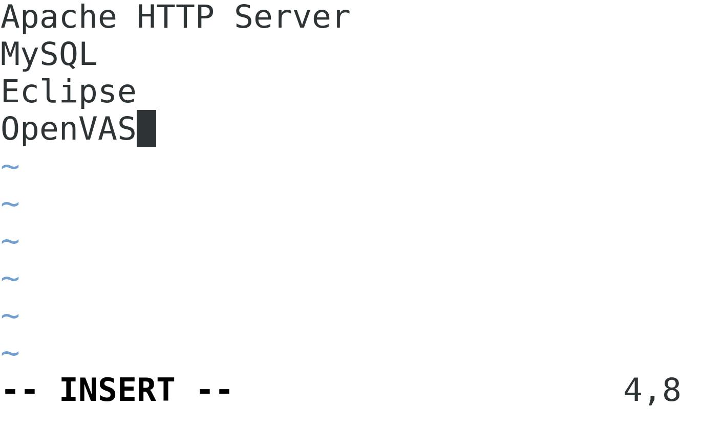
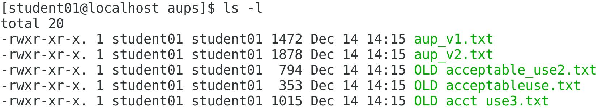
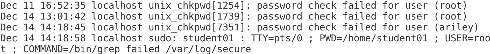
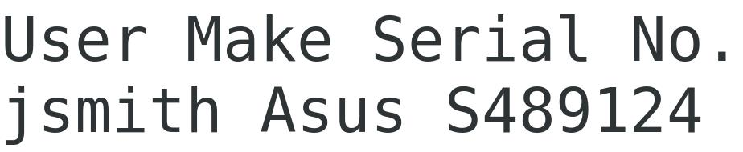
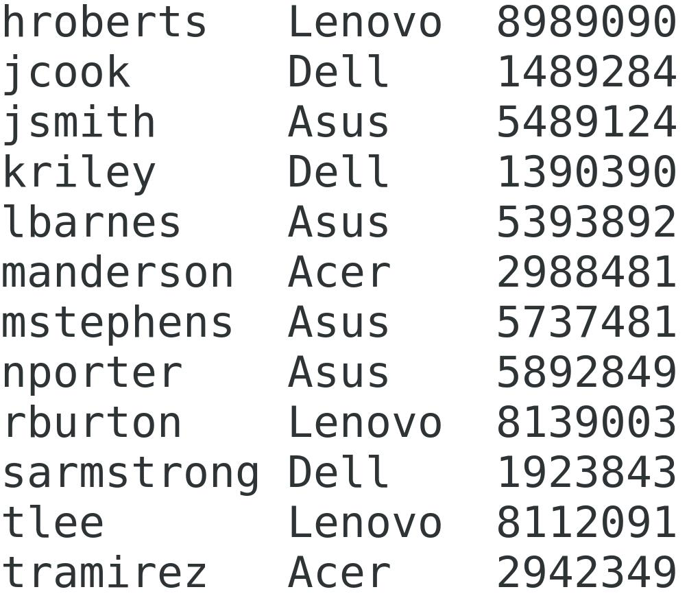

# Managing Files and Directories

## Creating Text Files

### **Scenario**

```text
As one of the Linux server administrators, you've been asked to start a list of software that is installed or should be installed on the system. So, you'll create a text file and begin entering the names of software packages into it. You'll then save your work and pick up with the file later.
```

### Objectives

---

```text
Completing this activity will help you to use content examples from the following syllabus objectives:
   2.3 Given a scenario, create, modify, and redirect files
```

1. Create the software list file by using the Vim text editor
   - Log in as `student01` with `Pa22w0rd` as the password.
   - Verify you are in your `home` directory.
   - Enter `vim software_list.txt` to start editing a new file in Vim.
   - Press `i` to switch to Insert mode.
   - Recall that Vim has three modes. Each mode may be thought of as a keyboard mapping. When you are in Insert mode, the keyboard inserts text into the file. When you are in Command or Execute mode, the keyboard issues commands to the Vim program.
   - Verify that the text "`INSERT`" is displayed at the bottom-left of the screen.
   - On the first line, enter `Apache HTTP Server`
   - Enter `MySQL` on the second line.
   - Enter `Eclipse` on the third line.
   - Type `OpenVAS` as the fourth and final entry.
   - Your Vim file should look like the image below:
   - 
   - Press `Esc` to return to Command mode.
   - Remember that `Esc` returns you to Command mode. The lower case `i` moves you from Command mode to Insert mode, though there are other keys that have a similar function. The colon : moves you from Command mode to Execute mode, which gives you a command prompt within Vim.
   - Enter `:wq` to write (save) your changes to the file and quit Vim.
   - Enter `cat software_list.txt` to view the file.

## Editing Text Files

### **Scenario2**

```text
A colleague has taken your initial software list file and started filling it out. After he's done, you look it over to see if there are any mistakes that need correcting. You'll edit this file in both Vim and GNU nano to become more familiar with both text editors.
```

### Objectives

```text
Completing this activity will help you to use content examples from the following syllabus objectives:
   2.3 Given a scenario, create, modify, and redirect files
```

1. Copy the latest version of the software list
   - Enter `cp -a /opt/linuxplus/managing_files_and_directories/software_list.txt ~`
   - Remember, you can use `tab completion` to speed up the process.
   - Enter `ls` and verify that `software_list.txt` is listed.
1. Open the file in `Vim` and correct a spelling error
   - Enter `vim software_list.txt` to open the file. Remember that Vim opens in Command mode.
   - Use the arrow keys to move the cursor down to the first instance of the text "`Friefox`".
   - Position the cursor under the "`i`" in "`Friefox`".
   - Press `x` to cut the letter "`i`".
   - Move the cursor under the letter "`F`" and press `p` to paste the cut letter.
   - Verify that the line now correctly says "`Firefox`".
1. Use the search functionality built into Vim to find and correct the other instance of the spelling error
   - Enter "`/Frie`" to search for the next occurrence of the misspelled name.
   - You use the `/` to create a command prompt at the bottom of Vim and then you enter the text you wish to search for.
   - Correct the name so that it says "`Firefox`".
1. Fix the casing of one of the software names
   - Press `k` to go up line-by-line until you reach the line that says `"openVAS"` (note the lowercase "o").
   - Press `^ (Shift+6)` to go to the beginning of the line.
   - Press `x` to delete the first letter.
   - Press `i` to enter Insert mode, then type an uppercase O
   - Press `Esc` to exit Insert mode and return to Command mode.
1. Delete a duplicate line and save the file
   - Press `j` to go down line-by-line until you reach the second line that mentions `Apache`.
   - Press `d` twice to delete the entire line.
   - Enter `:wq` to write your changes and quit the file.
1. Open the file in `GNU nano` and make a correction
   - Enter `nano software_list.txt` to open the file in the nano text editor.
   - The nano text editor is common on many Linux distros. You should know the basics of both Vim and nano.
   - Use the arrow keys to move to the `Y` under the "`Configured?`" column for "`Eclipse`".
   - Press `Delete`.
   - Type `N`
1. Remove a duplicate line
   - Navigate down to the __second__ instance of "`LibreOffice`".
   - Press `Ctrl+K` to cut the duplicate line.
   - Note that some of the most common key commands for nano are displayed at the bottom of the window. There are many other key commands as well.
1. Add another entry to the file
   - Navigate to the beginning of a new line at the bottom of the file.
   - Type `Apache-Tomcat`
   - Press Tab until the cursor is under the "Version" column.
   - You can also use the spacebar for more precise alignment.
   - Type `9.0.12`
   - Place the cursor under the "`Installed?`" column and type `N`
   - Type `N` under the "`Configured?`" column.
   - Press `Ctrl+O` "write out" or save you changes to the file.
   - Press `Enter` to save the file.
   - Press `Ctrl+X` to exit GNU nano.
   - Enter `cat software_list.txt` to display the file.

## Searching for Files

### Scenario3

```text
One of your duties as a Linux administrator is to ensure your system logs are functioning as expected. These logs are crucial to diagnosing issues and identifying other unwanted behavior. So, to start, you'll search for where the log files are stored on your system. Then, you'll begin to search for logs that meet specific size requirements and have been recently updated. That way you'll be able to confirm which logs are continuously recording a significant amount of information, as expected.
```

### Objectives

```text
Completing this activity will help you to use content examples from the following syllabus objectives:
   2.3 Given a scenario, create, modify, and redirect files
   3.4 Given a scenario, implement logging services
```

1. Search for the location of system log files.
   - Enter `sudo find / -type d -name 'log'` to search the root of the filesystem `/` for a directory `d` with a name that includes the string `log`.
      - Verify that there are several locations on the root volume that contain the word `log`.
   - Enter `sudo find / -type f -name 'messages'` to search the root of the filesystem `/` for a file `f` with a name that includes the string `messages`.
      - Verify that the location of the messages `log` is identified as `/var/log/messages`
   - Enter `sudo find /var/log -type f -size +100k` to search for log files that are greater than 100 KB in size.
      - Pick one of the files in the results and enter `ls -lh /var/log/[file name]` to verify that it is indeed greater than 100 KB in size.
   - Enter `sudo find /var/log -type f -mmin -30` to search for log files that have been updated within the last 30 minutes.
      - Verify that one of the files in the results has a timestamp within the last 30 minutes.
      - You can use `ls -l` on the file to display details about the file, including when it was last modified.
   - Enter `sudo find /var/log -type f -size 0 -or -size +100k -mmin -30` to search for log files that are either empty or above 100 KB, and have been updated in the last 30 minutes.
      - Verify that these conditions are accurate for at least one of the files.
   - What are some advantages of using the find command over using the locate command? Click here for the answer.

      ```text
      The locate command requires that a database be updated in order to perform accurate searches, whereas find does not. Also, locate cannot filter its search by specific directories, whereas find can. However, locate may be able to perform searches more quickly in certain cases.
      ```

## Reading Files

**Scenario4**
Another one of your duties is, naturally, to review the system's log files. But before you dive into log analysis, you need to determine the best way to display text files for reading. So, you'll use commands like cat and less to see where each one can come in handy.

### Objectives
Completing this activity will help you to use content examples from the following syllabus objectives:
2.3 Given a scenario, create, modify, and redirect files

1. Reading logs
   - Enter `sudo cat /var/log/messages` to open the messages log for reading.
      - Notice that the file's contents scroll past the screen many times, indicating that the file is too large to read from a single screen.
   - Enter `sudo less /var/log/messages` to display the file by using the less command.
      - Verify that only the first page of the file printed to the screen, and at the bottom of the screen, the name of the file is highlighted.

      ```plaintext
      The less utility breaks a long file down into pages that fit on the screen. You can then scroll through the pages.
      ```

   - Press the `Down Arrow` to scroll down a single line.
   - Press the `Up Arrow` to scroll back up a single line.
   - Press `Space bar` to scroll down an entire page.
   - Press `Page Up` to scroll up an entire page.
1. Search for a specific string in the log.
   - Enter `/SELinux` to search for the string `SELinux`.
   - Note that this is the same search syntax as you used in the `Vim text editor`.
   - Verify that the file jumps to the first instance of this text string, and that it is highlighted on the top line.
   - Press `n` to view the next instance of this text string in the file.
   - Press `N` (note the capitalization) to navigate to the previous instance of the search term in the file.
   - Press `q` to quit reading the file.
   - Remember, you can enter `clear` to clear the screen as needed.
1. Display only the first and last lines of the log
   - Enter `sudo head /var/log/messages` to display the first several lines of the file.
      - Verify that the *first 10 lines* of the messages log were printed to the screen.
   - Enter `sudo tail /var/log/messages` to display the last several lines of the file.
      - Verify that the *last 10 lines* of the messages log were printed to the screen.
   - Why might displaying only the first or last few lines be preferable to reading the entire file? Click here for the answer.

      ```text
      Answers may vary, as it depends on the purpose and format of the text file. For logs, reading the last 10 lines is a much quicker way to see the latest events on a system than using less would be. Printing the first 10 lines might be useful in situations where entries are repeated or otherwise superfluous, and you only need to see a few examples to grasp the idea.
      ```

## Manipulating Files and Directories

### **Scenario5**

```text
You've been asked to move some corporate policy documents from the HR lead's workstation to a Linux server. The policies should be more centrally available and not dependent on one particular person's system. The HR lead admits that she didn't do a great job organizing the policy documents, as several older versions of acceptable use policies (AUPs) are mixed in with more current, active versions, and the old policies were written before she implemented a consistent naming convention. All of the documents are in a single directory named aups.
First, you'll need to copy the documents to your home directory as a temporary staging area. You'll then organize these policy documents by retaining only the most recent ones and deleting older ones that no longer apply. You've also been told that more types of policies will need to be located on the server, other than AUPs. So, you'll effectively rename the aups folder to the more general policies and create some placeholder files. Later, when you receive more policies to add, you'll be able to deploy the directory where other authorized users can reach it.
```

### Objectives

---

```text
Completing this activity will help you to use content examples from the following syllabus objectives:
   2.3 Given a scenario, create, modify, and redirect files
```

1. Manipulate
   - Enter `cp -r /opt/linuxplus/managing_files_and_directories/aups ~` to copy the aups directory to your home directory.
   - This copies the `aups` directory to your home directory, leaving its original location intact.
   - Enter `cd aups` to change directories.
   - Enter `ls -l` and verify there are five files, three of which are marked as "OLD" and have inconsistent file names.
   - 
2. Create a new directory and move the most recent policy files into it
   - Enter `mkdir ../policies` to create a new directory.
   - Enter `mv aup_v1.txt ../policies` to move the file.
   - Enter `mv aup_v2.txt ../policies` to move the file.
   - Enter `ls -l` and verify that these two files are no longer in this directory.
   - Enter `cd ../policies` to change to the policies directory.
   - Enter `ls -l` and verify that the two recent files are now in this directory.
3. Create placeholder files for future policies
   - Enter `touch user_sec_policy.txt` to create a new empty file named `user_sec_policy.txt`
   - Enter `ls -l` and verify that a blank file with this name was created.
   - Use `touch` to create three more blank files in `~/policies` with the following names:

      ```bash
      - server_sec_policy.txt
      - email_policy.txt
      - clean_desk_policy.txt
      ```

   - Enter `ls -l` and verify that the files exist.

4. Delete the aups directory and its contents as it is no longer needed
   - Enter `rmdir ../aups`
   - Verify that you cannot remove this object because it is a directory with contents.
   - You need to specify the `-R (recursive)` option with `rm` in order to delete non-empty directories.
   - Enter `rm -R ../aups` to delete the directory and its contents.
   - Enter `ls ..` and verify that the `aups` directory is gone, as are the old policy files.

## Processing Text Files

### **Scenario6**

```text
Now that the software list and policy documents are all set and in the right locations, you can begin to analyze them more closely. In particular, you want to sort the software list so you can more quickly identify what software packages still need to be installed and/or configured. Likewise, you want to ensure that you know exactly what was changed from the first version of the AUP to the second version, so you don't have to read the entire thing from the beginning.
You also want to switch gears to your log analysis duties. You want to identify instances where users enter an incorrect password and fail to log in. This could point to users that are trying to access resources they are not authorized for. However, the authentication log can be very large, so you'll need to process it in order to extract only the relevant information.
```

### Objectives

---

```text
Completing this activity will help you to use content examples from the following syllabus objectives:
    2.3 Given a scenario, create, modify, and redirect files
```

1. Sort the software list file by name, then by which packages need to be installed and/or configured.
   - Enter `cd ~` to return to your home directory.
   - Enter `cat software_list.txt` to review the column structure of this file.
   - Enter `sort -k1 software_list.txt`
      - Verify that the list was sorted by the first column, which is the name of each software package. However, the sort operation was not perfect, as the column headers were included. There are several ways to stop this from happening, one of which you'll perform in a later topic.
   - Enter `sort -k3 software_list.txt` to sort by the `"Installed?"` column.
   - Sort by the "`Configured?`" column.
1. Retrieve the word count of the AUP files.
   - Enter `cd policies` to change directories.
   - Enter `wc -w aup_v1.txt`
      - Verify that you can see the word count of version 1 of the `AUP` policy file.
   - Enter `wc -w aup_v1.txt aup_v2.txt`
      - Verify that you can see the word counts of both versions of the file, as well as a combined total.
   - Enter `diff aup_v1.txt aup_v2.txt` to display the differences between the two files.
      - Verify that you are presented with the differences between each file, as well as suggested actions.
   - The differences are as follows:
      - `33a34,41` means that after `line 33` in the first file (version 1), lines `34–41` from the second file (version 2) need to be added in order for that chunk of text to be the same.
      - The multiple `>` symbols indicate each line that must be added to the first file in order to be the same as the second file.
         - In other words, the HR lead added this entire new section to `version 2` of the policy.
      - `35a44` means that at `line 35` in the first file, `line 44` from the second file needs to be added in order for the text to be the same.
         - In other words, the HR lead added an entry to the revision history explaining her changes.
1. Search the authentication log for failed login attempts.
   - Enter `sudo cat /var/log/secure` to display the contents of the secure log file.
      - Verify that there are many entries in the authentication log.
   - Rather than read the entire log or search `term-by-term` for failure entries, you can use `grep` to bring all of the relevant information to the forefront with one command.
   - Enter `su - ariley` and provide an incorrect password to simulate an authentication failure.
      - Do not actually sign in. The purpose of this step is to generate a message in the log file.
   - Enter `sudo grep failed /var/log/secure` to search for the string failed in the secure log file.
      - Verify that you are presented with all lines in the log containing the text string "`failed`".
   - 

## Linking files

### **Scenario7**

```text
You've decided to start organizing your backup directory, particularly with regard to log files. You want to create several subdirectories, each one a category that can pertain to the backed up logs. For example, you want to organize logs by type (e.g., authentication logs vs. app logs vs. kernel logs) and the year that they were generated. However, most logs can apply to multiple categories. Rather than have two or more distinct copies of each log, you decide to link these files together so that they're easier to manage.
You also want to be able to quickly access log backups from your home directory. So, you'll create a link in your home directory to a log in the backup directory.
```

### Objectives

```text
Completing this activity will help you to use content examples from the following syllabus objectives:
        2.3 Given a scenario, create, modify, and redirect files
```

1. Create new log backup directories and move the authentication log to one of them
   - Enter `mkdir /backup/log/auth /backup/log/year` where year refers to the current year.
   - Enter `sudo cp /var/log/secure /backup/log/auth/secure`
   - Enter `cd /backup/log`
1. Create a hard link between the log files
   - Enter `sudo ln auth/secure year/secure`
      - This creates a hard link to the file in the auth directory.
   - Enter `ls -l year` and verify that a file was created in the year directory.
   - Enter `sudo cat year/secure` and verify that its contents are the same as the authentication log.
      - You can run `diff auth/secure year/secure` if you want to be sure.
1. Make a change in one file and see it reflected in the hard link file
   - Enter `sudo nano auth/secure`
   - Press `Enter` to start a new line at the top.
   - Type `BEGIN LOG ##-####` where the hashes are the current month and year.
      - For example: `BEGIN LOG 01-2019`
   - Press `Ctrl+O` then `ENTER` to save.
   - Press `Ctrl+X` to quit.
   - Enter `sudo head year/secure` and verify that the header you just added was also added to the hard link file.
1. Remove one file and verify that the hard link is still intact
   - Enter `sudo rm auth/secure`
   - Enter `sudo cat year/secure` and verify that the hard link file's contents are still intact.
1. Attempt to create a link from your home directory to a log file in the backup directory
   - Enter `cd ~` to return to your home directory.
   - Enter `sudo ln /backup/log/year/secure auth-log`
     - Verify that the operation failed.
     - You cannot create hard links across different file systems, and the home directory and the backup log directory are on different file systems. To get around this, you must create a soft (symbolic) link.
1. Create a symbolic link to the log file
   - Enter `ln -s /backup/log/year/secure auth-log`
   - Enter `sudo cat auth-log` and verify that your link has the expected log contents.
1. Delete the original log file and verify that the symbolic link was affected
   - Enter `sudo rm /backup/log/year/secure`
   - Enter `sudo cat auth-log` and verify that so such file exists.
   - Enter `ls -l` and verify that the file is a broken link.
   - You should see red text pointing to text with a black background indicating that the link is broken.
   - Enter `rm auth-log` to delete the symbolic link.

## Manipulating File Output

### **Scenario8**

```.txt
In the past, the IT team has kept an inventory of all laptops issued to employees. As part of the new roll-out, you'll need to copy this information to a document that will be stored on a Linux server. The source information isn't formatted very well, and isn't in any kind of useful order. So, you decide to create a new file from scratch Afterward, you realize that the person who recorded the information made a mistake with the format of certain serial numbers. Instead of editing the file to replace every mistake individually, you'll leverage input and output redirection to fix the mistakes. Then, you'll output a sorted version that will be more useful for reference.
You also want to regularly check the contents of the backup directory and place the results in a continually updated file. You want to be able to see the results in real-time at the CLI as well, so you'll use the tee command to accomplish both.
Lastly, you'll use piping with grep to further hone your log analysis skills.
```

### Objectives

```text
Completing this activity will help you to use content examples from the following syllabus objectives:
2.3 Given a scenario, create, modify, and redirect files
```

1. Use output redirection to start adding text to the laptop inventory file.
   - Enter `touch laptop_inv.txt` to create a blank file.
   - Enter `echo "User Make Serial No." > laptop_inv.txt`
      - Separate each column by four spaces.
   - Enter `cat laptop_inv.txt` and verify that the text output to the file.
1. Use output redirection to append text to the file.
   - Enter `echo "jsmith Asus S489124" > laptop_inv.txt`
   - Enter `cat laptop_inv.txt` and verify that the header was replaced by this new row.
      - This is because the `>` operator replaces any existing text with the provided string. You need to append that text.
   - Reenter `echo "User Make Serial No." > laptop_inv.txt`
      - Remember, you can press the Up Arrow to return to a command you previously entered.
   - Enter `echo "jsmith Asus S489124" >> laptop_inv.txt`
      - Again, separate each column by four spaces.
   - This time, you're using the append operator `>>`.
      - Verify that the file has both the header and the first row.
         
1. Use input redirection to replace all instances of a mistyped character in the file.
   - Enter `cp /opt/linuxplus/managing_files_and_directories/laptop_inv.txt laptop_inv.txt`
      - This will update your copy with a filled-in one.
      - Examine the file and verify that the `Asus serial numbers` incorrectly start with the capital letter "`S`".
   - Enter `tr S 5 < laptop_inv.txt`
      - Verify that the instances of "`S`" were replaced with "`5`" and that the file was printed to the CLI.
1. Use both input and output redirection at the same time to create a new file with the corrections.
   - Enter `tr S 5 < laptop_inv.txt > laptop_inv_fix.txt`
      - Examine the corrected file and verify that the appropriate correction was made.
1. Use piping to sort the inventory list without the header.
   - Enter `sort -k1 laptop_inv_fix.txt` to sort the contents.
   - Observe that, just like sorting the software list earlier, the header is included in the sort when it shouldn't be.
   - Enter `tail -n +3 laptop_inv_fix.txt | sort -k1`
   - The `tail -n +3` command outputs everything after and including the third line, which is when the header ends. You are piping the output of this command to the sort command, which takes it as input.
      - Verify that the inventory is now sorted by user name, but does not include the header.
   - 
1. Use the `tee` command to redirect output to both the CLI and a file at the same time.
   - Enter `sudo ls -lR /backup > backup_report`
      - Verify that `ls` didn't print its results to the CLI.
   - Enter `sudo ls -lR /backup | tee backup_report`
      - Verify that `ls` did print its results to the CLI.
      - This is because piping the `ls` command to `tee` instead of doing a `stdout redirect` ensures that the results will appear at both the CLI and the specified file.
   - Examine the `backup_report` file and verify that it also lists directory information.
1. Use `grep and cut` together to make log analysis easier.
   - Enter `sudo grep 'password check failed' /var/log/secure`
   - This prints all instances of the text "`password check failed`" from the authentication log. 
      - However, it also prints every single part of the line, much of which isn't relevant and just adds to the noise.
   - Enter `sudo cut /var/log/secure -d " " -f5-12`
      - The `cut` command, using the `-d` option, trims each line using a space as a delimiter. The `-f5-12` option specifies the range of the delimiter to extract. So, you're only extracting approximately the middle chunk of each line. However, you're still seeing every line of the log.
   - Enter `sudo grep 'password check failed' /var/log/secure | cut -d " " -f5-12`
      - Verify that you extracted all lines matching the provided string, as well as only the portion of the line that is relevant to your needs.
      - The results show the system function that was called, an explanation of the event, as well as the user the event applies to.
