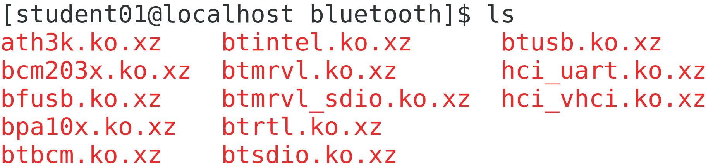

# 06: Managing Kernel Modules

## Exploring the Linux Kernel

> Scenario
        As a system administrator, you may need to troubleshoot issues related to the kernel. So, you want to explore kernel concepts to refresh your knowledge.

### Objectives

```text
Completing this activity will help you to use content examples from the following syllabus objectives:
    1.2 Given a scenario, install, configure, and monitor kernel modules
```

1. Log in as `student01` with `Pa22w0rd` as the password.
2. Enter `uname -a` to view information related to the currently running Linux kernel.
3. What is the base version of your currently running kernel according to the `uname` command?
    ○ 2.4 </br>
    ○ 2.6 </br>
    ○ 3.4 </br>
    ○ 3.10 </br>
    ○ 4.18 </br>
    Click here for the answer. -> `3.10`

4. True or False? According to the `uname` command, you are running a 32-bit hardware platform.
    Click here for the answer. -> `False`

5. Which function is associated with the SCI layer of the kernel?
    ○ Passing requests to device drivers. </br>
    ○ Sending service requests to the kernel. </br>
    ○ Allocating processor time for functions. </br>
    ○ Processing scheduling functions. </br>
    ○ Organizing files on the file system. </br>
    Click here for the answer. -> `Sending service requests to the kernel.`

6. What are the major functions performed by the kernel? (Choose two.)
    ☐ Kernel initialization </br>
    ☐ `Process management` </br>
    ☐ `Memory management` </br>
    ☐ Module installation </br>
    ☐ Dependency management </br>
    Click here for the answer.

7. Which of the following accurately describe the user space? (Choose two.)
    ☐ It is the area of the memory where the kernel executes its services. </br>
    ☐ `It is the area of memory in which most high-level software runs.` </br>
    ☐ It is the part of the system that only logged in users can access. </br>
    ☐ `It is the area of memory in which background processes and low-level system libraries run.` </br>
    Click here for the answer.

8. What is one disadvantage of a `monolithic kernel` compared to a `microkernel`?
    ○ Monolithic kernels are slower to access devices. </br>
    ○ `Monolithic kernels are larger and consume more RAM.` </br>
    ○ Monolithic kernels have a smaller kernel space and are less extensible. </br>
    ○ Monolithic kernels can only run the bare minimum software to qualify as a fully functional OS. </br>
    Click here for the answer.

9. True or false? The `Linux` kernel is modular, enabling users to extend its functionality.
    Click here for the answer. `True`

---

## Installing and Configuring Kernel Modules

>Scenario

```text
You want to be able to wirelessly transfer files from the Linux server to your mobile device. So, you purchase a USB Bluetooth adapter and plug it into an available port on the server. However, you can't get the adapter to work properly. After examining the system, you discover that the driver for USB Bluetooth is not available. So, you'll inspect the kernel and see if you can identify and load the module that enables this functionality.
```

> Objectives

```text
+ Completing this activity will help you to use content examples from the following syllabus objectives:
  + 1.2 Given a scenario, install, configure, and monitor kernel modules
```

1. `Enter lsmod | less` to examine what modules are currently running.
   + Briefly scan through the list of installed kernel modules.
   + Press `q` to quit.
   + Enter `lsmod | grep bluetooth` to filter the module information for bluetooth content.
   + Verify that there are no results.
   + You don't yet know the name of the relevant module, so this isn't necessarily definitive proof that it isn't loaded.

1. Search for the appropriate module.
   + Enter `uname -r` to retrieve the kernel version of the system.
   + Enter `cd /lib/modules/[kernel version]/kernel/drivers`
       + Remember to use `tab` completion to fill the kernel version automatically.
   + Enter `ls | grep bluetooth` and verify that there is a bluetooth directory.
   + Enter `cd bluetooth` to change to the bluetooth directory.
   + Enter `ls` to see the available Bluetooth driver modules.
   + 
   + Do any of these look like they could be a driver for a USB device that can send and receive Bluetooth signals? Click here for the answer.
     + > Answers may vary, but btusb.ko.xz is the most likely candidate.
   + Enter `modinfo btusb.ko.xz | less` to learn more about this module.
   + Read the information about this module, noting the following:
       + The description indicates that this is a generic Bluetooth USB driver.
       + It has many different aliases that aren't very user friendly.
       + It depends on several other modules.
   + Press `q` to quit.

1. Configure an alias for the Bluetooth USB module.
   + Enter `cd /etc/modprobe.d` to change to the `modprobe.d directory`.
   + Enter `sudo vim btusb.conf` to create a configuration file for the module.
   + Create a new empty file by using `Vim`, and then type `alias blue btusb` as the first line.
   + Save and close the file.

1. Insert the Bluetooth USB module into the running kernel.
   + Enter `sudo depmod` to update the dependencies database.
   + Enter `sudo modprobe -a blue`
   + Enter `lsmod | grep btusb`
   + Verify that the `btusb` module is listed, indicating that it is inserted into the kernel.
   + Notice that there are other modules that begin with `bt`, as well as a module called `bluetooth`. Why were these added to the kernel as well? Click here for the answer.
     + > These are modules that btusb depends on in order to function. The modprobe command automatically installs dependent modules when necessary.

## Monitoring Kernel Modules

> Scenario

Now that you installed the USB Bluetooth module, you want to make sure it was successfully loaded by the kernel and that there are no errors. You also want to identify your kernel version details in case you need to reference it during troubleshooting.

### Objectives_

```text
Completing this activity will help you to use content examples from the following syllabus objectives:
   + 1.2 Given a scenario, install, configure, and monitor kernel modules
```

1. Enter `cat /proc/version` and use the result to answer the following questions.
   + When was the kernel last compiled? Click here for the answer.
        > Answers may vary, but the version used to develop this course was compiled on November 8th of 2018
   + What version of the GCC is your kernel running? Click here for the answer.
        > Answers may vary depending on when the kernel was compiled. For the kernel version used to develop this course, the GCC version is 4.8.
   + Why might this information be useful? Click here for the answer.
        > Answers may vary, but validating the kernel version and related information can help you diagnose issues that apply to specific versions, such as incompatible software.
   + Enter `dmesg -h` to examine the kernel message help.
   + Note the different facilities and log levels available. Examples include warn, err, notice, etc.
   + Enter `dmesg -H`
       + Don't forget to use the man pages to discover the meaning of the different options for commands. What is the meaning of the `-H` option for `dmesg`?
   + Verify that you can navigate through many pages of kernel messages.
   + Not all of the information here will be useful to you, so you'll need to filter what you're looking for.
   + Press `q`.

1. Filter the kernel message buffer for more useful messages.
   + Enter `dmesg -H -l warn`
   + Verify that the results have been filtered.
   + All of these messages are marked as warning conditions. These don't necessarily indicate errors but call attention to behavior that might be worth checking.
   + If necessary, press `q`.
   + Enter `dmesg -H -l err`
   + These messages do indicate errors. You might not have any results, which means the kernel hasn't recorded any errors thus far.
   + If necessary, press `q`.
   + Enter `dmesg -H | grep usb` to search the kernel message buffer for evidence of USB drivers being loaded.
1. Examine the results.
   + The kernel records when USB storages devices are found and when drivers are registered. It also identifies when input devices that use USB are found—like a mouse, keyboard, webcam, etc.
   + Enter `dmesg -H | grep btusb` to use `grep` to search for Bluetooth USB information.
   + Verify that the kernel is reporting that a new interface driver was registered for the `btusb` module you installed earlier.
   + 
