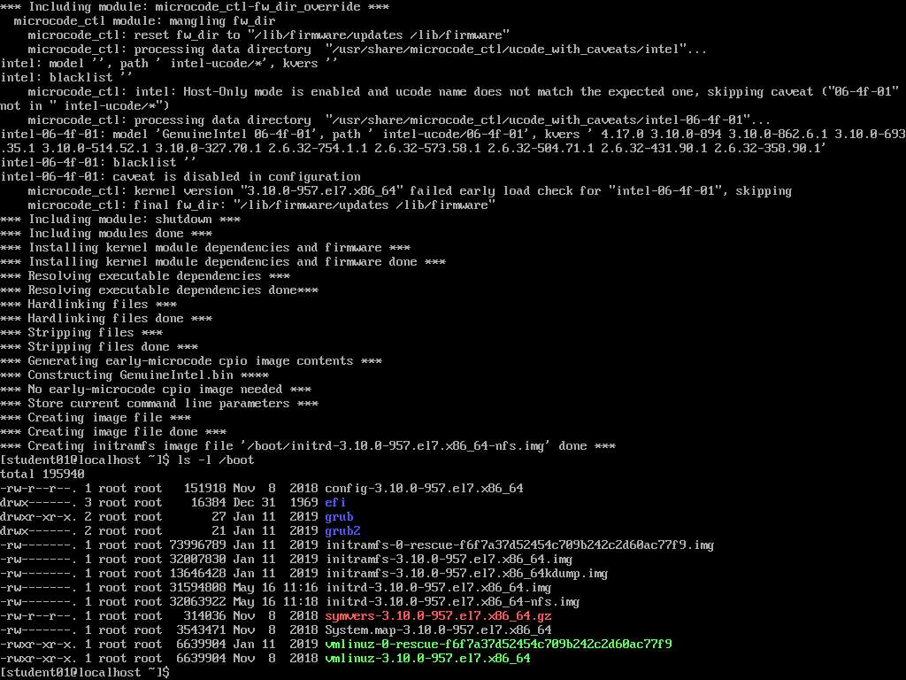
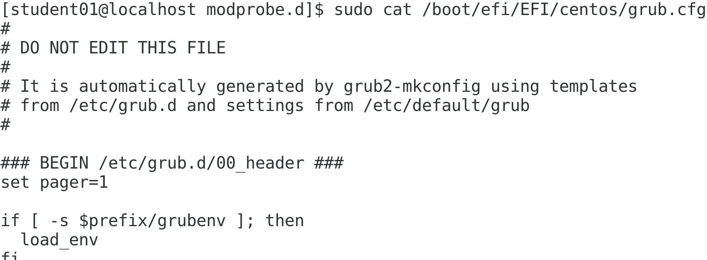
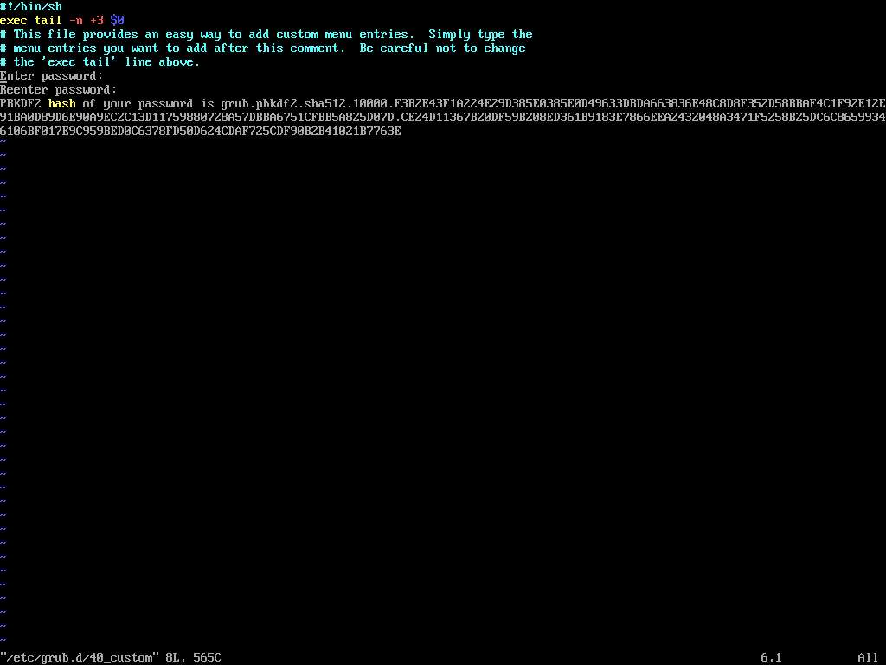
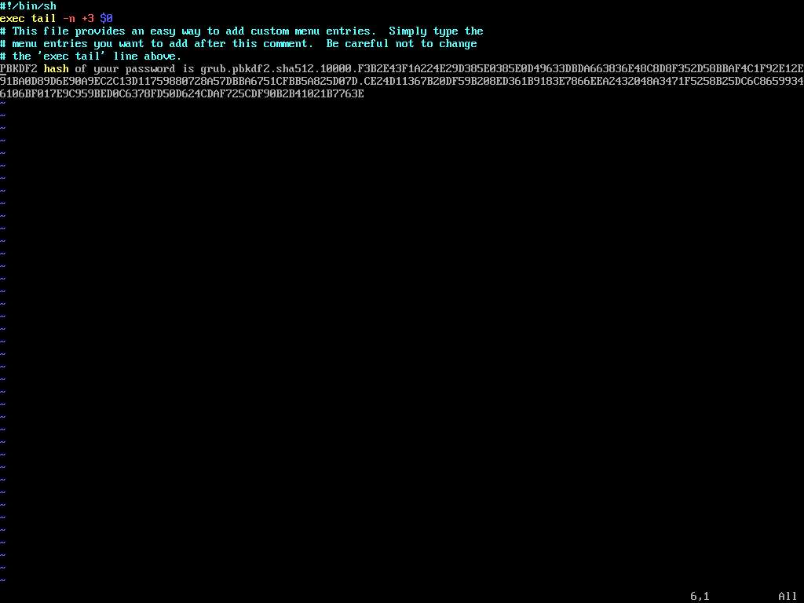
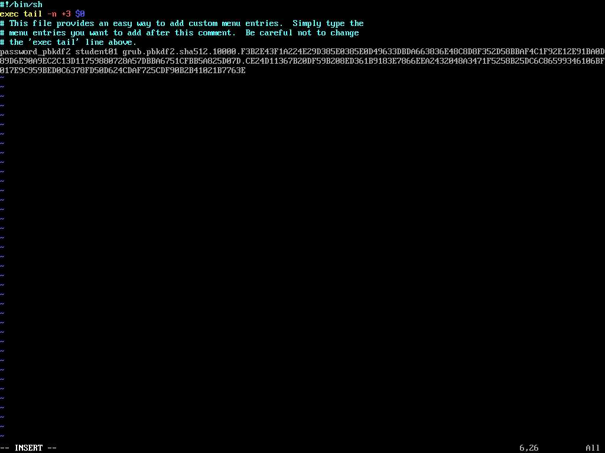
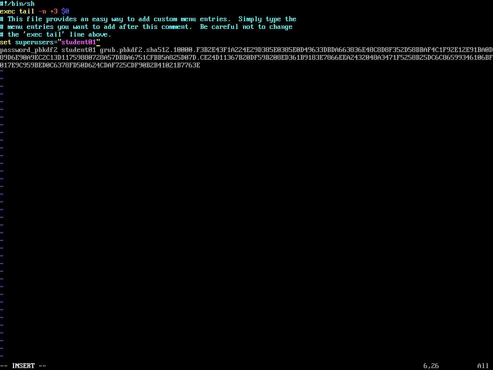
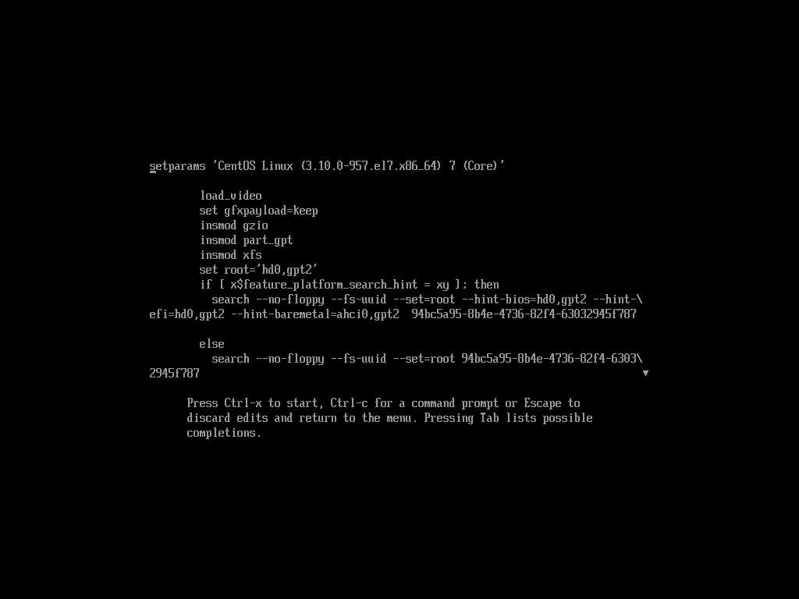

# Managing The Linux Boot Process

## Creating an initrd Image

> Scenario

```text
As part of your server infrastructure, you plan on having some systems boot from an NFS share. The kernel in the deployed systems doesn't have an NFS module. Without this, your systems cannot mount an NFS share as the root file system. So, you need to create a new initrd image so that the kernel can successfully mount the share. First, however, you'll establish a baseline image that other images can build off of.
```

> Objectives

- Completing this activity will help you to use content examples from the following syllabus objectives:
  - 1.1 Explain the Linux boot process
  - 3.3 Summarize security best practices in a Linux environment

1. Create a new `initrd` image.

   - Log in as `student01` with `Pa22w0rd` as the password.
   - Enter `uname -r` to identify the current kernel.
   - Enter `sudo mkinitrd -v /boot/initrd-$(uname -r).img $(uname -r)`
     - `$(uname -r)` substitutes the name of the kernel in this command.
   - Examine the verbose output from mkinitrd noting the various kernel modules that are included in the initrd image by default.
   - Enter `ls -l /boot` and verify that your new initrd image was created.
   - The image should be named `initrd-.img` and should have been last modified on today's date.

1. Create an `initrd` image with an NFS module installed.
   - Enter `sudo mkinitrd -v --with=nfsv4 /boot/initrd-$(uname -r)-nfs.img $(uname -r)`
     - Check your syntax before you hit enter. Also, do not forget that Tab completion can make your life a great deal easier.
   - Enter `ls -l /boot` and verify your new NFS image was created.
   - Examine the file sizes for both `initrd` images (the base image and the NFS image) and verify that the NFS image is larger. This suggests that the additional NFS module was loaded into the image, as intended.
   - 

## Configuring GRUB 2

- Scenario

```text
Some of your fellow administrators are claiming that their Linux servers aren't booting properly. You are assigned to the task of troubleshooting these issues. You find that someone has modified the settings in the boot loader because there is no password protection. After correcting the boot configuration, you decide to protect GRUB 2 with a password so that only authorized users can modify it.
```

> Objectives

- Completing this activity will help you to use content examples from the following syllabus objectives:
  - 1.1 Explain the Linux boot process

1. Verify that GRUB 2 is installed.

   - Enter `sudo ls -l /boot/efi/EFI/centos` to display the contents of the directory.
   - Verify that `grub.cfg` exists in this directory.
   - The presence of this file usually indicates that `GRUB 2` is successfully installed on the EFI system partition.
   - Enter `sudo cat /boot/efi/EFI/centos/grub.cfg` and verify that the configuration file is populated.
   - 

2. Create a password to lock the `GRUB 2` configuration with.

   - Enter `sudo grub2-mkpasswd-pbkdf2 | sudo tee -a /etc/grub.d/40_custom`
   - You're redirecting the output to the custom configuration file. You'll clean up this file shortly.
   - Enter `Pa22w0rd` as the password.
   - Reenter the same password.
   - Verify that the `PBKDF2` password is generated.
   - `PBKDF2` uses a cryptographic technique called hashing to protect the password in storage.

3. Adjust the custom `GRUB 2` configuration file to require your password.

   - Using `sudo`, open `/etc/grub.d/40_custom` in the text editor of your choice.
   - 
   - Move the cursor to the line that says "`Enter password:`" and cut this entire line.
   - Cut the line after it that shows the `reenter password prompt`.
   - 
   - From the "`PBKDF2`" line, delete the string of text that says "`PBKDF2 hash of your password is`".
   - On the same line, replace the text you deleted with `password_pbkdf2 student01`
   - 
   - Insert a new line above this that says:
   - `set superusers="student01"`
   - 
   - Save and close the file.

4. Update the main GRUB 2 configuration file to apply your changes.

   - Enter `sudo grub2-mkconfig -o /boot/efi/EFI/centos/grub.cfg` to cause grub to create a new configuration file.
   - There may be an I/O error message for the `fd0` (floppy drive) device. This will not affect the boot process. Verify that no other errors are returned and that the "`done`" message is displayed.
   - This indicates that the new `GRUB 2` configuration file has been generated successfully.

5. Test the password from the GRUB 2 boot menu.
   - Enter `reboot` to restart the server.
   - On the `GRUB 2` boot menu screen, press `Esc` to stop the default selection timer.
   - Press `e` to edit the GRUB 2 configuration.
   - At the `Enter username` prompt, enter the account name `student01`.
     - Input your user name and password very carefully, as you will be unable to edit any mistakes.
   - At the `Enter password` prompt, enter `Pa22w0rd`
   - Verify that you can see the `GRUB 2` configuration on the screen.
   - 
   - Press `Esc` to exit editing mode.
   - Press `Enter` to boot back into the default selection.
   - Log back in as your student account.
