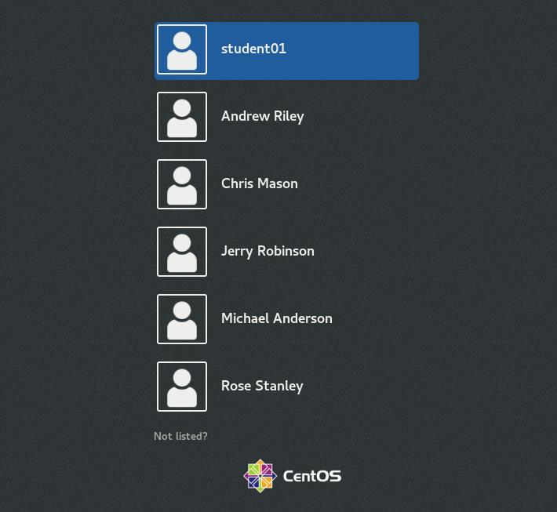
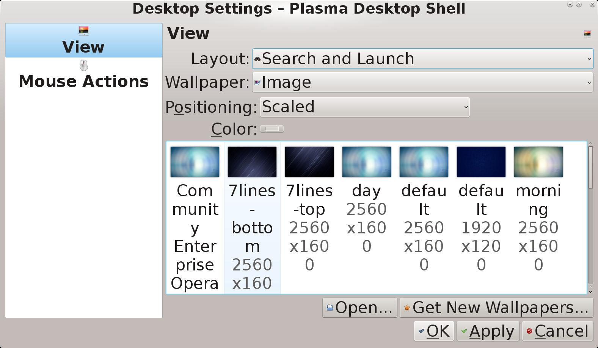
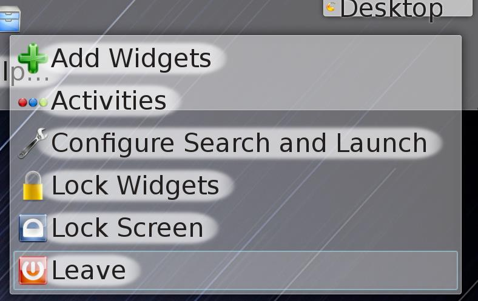
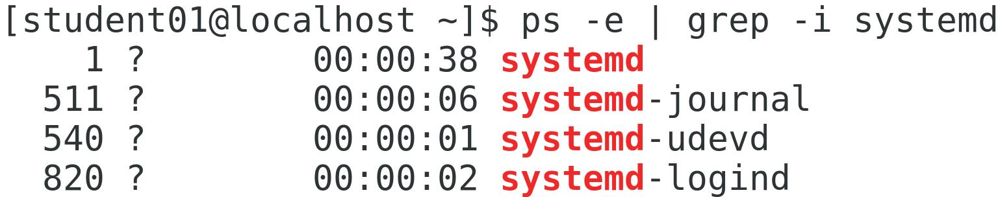
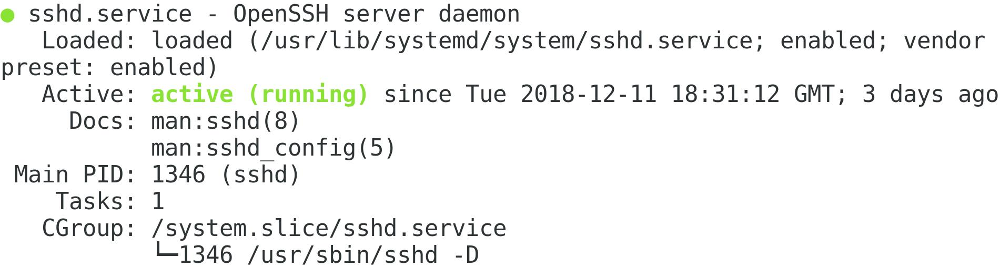
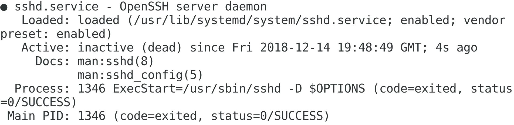

# 08: Managing System Components

## Configuring Localization Options

### Scenario

```text
One of your colleagues is located remotely—in London, England. Just like you, he needs to be able to log in to Develetech's Linux servers in order to administrate them. The server he needs to remotely administrate is located in the US, even though it primarily services users in Great Britain. So, you'll set this server to use the time zone in London, as well as change the language and keyboard layout settings to those of Great Britain. This will make it easier for your English colleague to work within the environment and for the server to operate within the correct time zone.
```

### Objectives

Completing this activity will help you to use content examples from the following syllabus objectives:
    1.6 Given a scenario, configure localization options

1. Retrieve your system's current date and time information.
   + Log in as `student01` with `Pa22w0rd` as the password.
   + Enter `timedatectl` to display time configuration information.
   + Verify that you are given information such as:

    |Index|Time|
    |---|---|
    |1|The local time.|
    |2|The universal time.|
    |3|The real-time clock (RTC) time (i.e., hardware clock).|
    |4|The time zone.|
    |5|Network Time Protocol (NTP) information.|
    |6|Daylight savings time (DST) information.|

1. Find the time zone for London.
   + Enter `timedatectl list-timezones` to list the time zones.
   + Verify that there are several pages of time zones available.
   + Time zones are categorized by global region, then typically by city or small nation. This information is pulled from the time zone files and directories in `/usr/share/zoneinfo`
   + Press `q` to quit and return to the prompt.
   + Enter `timedatectl list-timezones | grep London` to filter the results.
   + The relevant time zone is in the format Europe/London.
   + Enter `sudo timedatectl set-timezone Europe/London` to change the time zone to London's current time zone.
   + Enter `timedatectl` again to display the updated time configuration information.
   + Verify that the time zone has changed and that the local time reflects this change.
   + The time zone that is set will depend on the time of year. From the last Sunday in March to the last Sunday in October, the time zone will be `British Summer Time (BST)`. The rest of the year, London is on `Greenwich Mean Time (GMT)`, otherwise referred to as `UTC`.
   + Verify that the universal time is either the same as the local time or is one hour behind, depending on the time of year.
   + The universal time is synonymous with `GMT/UTC` and is used as a global reference point.
   + Examine the `RTC` time.
   + This is the hardware clock, and it is set by the OS. Many Linux distros set this to `UTC` by default, including `CentOS`. You'll leave this as-is.
   + Enter `date` to confirm the date and time on the system.

1. Find the appropriate locale settings for Great Britain.
   + Enter `localectl status` and note your system's current language locale and keyboard layout.
       + Take note of these values if your locale and keyboard layout are not US. You will need to revert to these values at the end of the activity.
   + Enter `localectl list-locales` to display available locale information.
   + Page through the list of available locales until you get to the locales that start with `en_ (English language)`.
   + Find the `en_GB.utf8 locale`.
   + This is a `locale for Great Britain` that uses `UTF-8 encoding`.
   + Press `q` to quit.
   + Enter `localectl list-keymaps` to display keyboard mapping information.
   + Verify that you can find a keyboard layout named `gb` indicating Great Britain.

1. Configure the appropriate locale settings for Great Britain.
   + Enter `sudo localectl set-locale "LANG=en_GB.utf8"`
   + Enter `sudo localectl set-keymap gb`
   + Enter `localectl status` and verify that the language locale and keyboard layout are both set to Great Britain.
   + On your keyboard, press the Backslash key and verify that it types a number symbol `(#)`.
   + This is due to layout differences between `US` and `GB/UK` keyboards.
       + This will, of course, only work if you're using a US keyboard.

1. For classroom purposes, revert the locale settings.
   + Enter `sudo localectl set-locale "LANG=en_US.utf8"`
       + Press the Up Arrow until you retrieve the command you used to set the locale to Great Britain. Then you can just replace the text.
       + If your original language and keyboard layout are something other than US, you will need to enter your original values instead.
   + Enter `sudo localectl set-keymap us`
   + Enter `localectl status` and verify that the original locale options are set.

## Configuring GUIs

### Scenario2

```text
The CLI has been adequate so far, but many of your colleagues would be more comfortable working in a visual environment. A GUI is also necessary for easily browsing the web and viewing media like images and video. Most of your colleagues prefer to work with GNOME, the default desktop environment, whereas others prefer a customized version of KDE. So, you'll start by configuring KDE's layout options to align with those users' preferences. Then, you'll get accustomed to navigating through GNOME, the environment you yourself will be using. You also need to configure some accessibility options in GNOME for users who have visual and manual dexterity impairments.
```

### Objectives2

---

```text
Completing this activity will help you to use content examples from the following syllabus objectives:
    2.8 Compare and contrast Linux graphical user interfaces
```

1. Switch to the GUI, then log in to KDE.
   + Enter `sudo systemctl isolate graphical.target` to launch the graphical user interface.
       + Recall that many Linux servers are run with no graphical user interface (`GUI`). The `GUI` can be a drain on system resources.
   + Verify that you are presented with a graphical login screen.
   + 
   + Select `student01`.
   + To the left of the Sign In button, select the Settings gear icon.
   + Select `KDE Plasma Workspace`.
   + Enter your password and select Sign In.
       + The two most common `GUIs` for `Linux` are `GNOME` and `KDE`. There are many others available, however.

1. Configure desktop settings for `KDE`.
   + On the desktop, right-click and select `Default Desktop Settings`.
   + In the Desktop Settings - `Plasma Desktop Shell window,` in the *left pane*, verify that __View__ is selected.
   + From the __Layout drop-down list__, select `Search and Launch.`
   + In the *images* section, select `7lines-bottom` from the thumbnails list.
   + 
   + Select OK to apply the settings and close the `Desktop Settings - Plasma Desktop Shell window`.
   + Examine the new layout of the desktop environment.

1. Switch to ``GNOME`.`
   + From the `top-right of the desktop`, select the `Desktop menu`, then select `Leave`.
   + 
   + Select `Logout`.
   + Select `student01`.
   + To the `left` of the `Sign In button`, select the `Settings icon`.
   + Select `GNOME Classic`.
   + Sign in using your `password`.
   + If displayed, go through the preliminary setup options.
   + On the `Welcome screen`, select `Next`.
   + On the `Typing screen`, select `Next`.
   + On the `Network screen`, select `Skip`.
   + On the `Privacy screen`, select `Next`.
   + In the dialog box, select __Deny Access__.
   + On the *Online Accounts screen*, select `Skip`.
   + On the *Ready to Go screen*, select `Start` using `CentOS Linux`.
   + Close the *Getting Started window*.
   + Examine the desktop and note that `GNOME` has a different look and feel than `KDE`.

1. Navigate the `GNOME` desktop and open an application.
   + From the desktop menu, select `Applications→Favorites→Files`.
   + Verify that you are in your `home` directory.
   + Double-click the `backup_report file` to open it in the default GUI text editor.
   + Make a change to the file, then select `Save`.
   + *Close* the text editor.
   + *Close* the file browser.

1. Enable accessibility settings in `GNOME` for users with visual and manual dexterity impairments.
   + Select `Applications→System Tools→Settings`.
   + From the navigation pane on the left, select `Universal Access`.
   + In the `Seeing section`, slide the __High Contrast slider to On__.
   + In the Pointing & Clicking section, select `Click Assist`. In the `Click Assist dialog box`, slide the `Hover Click slider` to `On`. In the `Hover Click dialog box`, select `Double Click`.
   + Close all open dialog boxes.

1. Open a `terminal`, then revert the accessibility changes.
   + From the desktop menu, point to (but don't click) `Applications→Favorites→Terminal`. The `Click Assist` feature will "click" the menu options for you.
   + From the top-right of the desktop taskbar, select the Universal Access icon , then slide `High Contrast to Off`.
   + Select `Applications→System Tools→Settings`. Select `Click Assist`. In the `Click Assist` dialog box, slide the Hover Click slider to Off.
   + Keep the terminal window open.

## Managing Services

### Scenario3

```text
As a Linux administrator at Develetech, you know that you will be implementing, managing, and reconfiguring different services. You'll be leveraging systemd, and in particular, the systemctl command and its associated subcommands, to manage these services. You decide to start by switching targets from CLI to GUI, and then making the default target GUI so that users will always boot into that environment by default. Then, you'll practice managing the SSH and firewall services by putting them through the service management lifecycle of starting, stopping, enabling, and disabling them.
```

### Objectives3

---

```text
Completing this activity will help you to use content examples from the following syllabus objectives:
    2.4 Given a scenario, manage services
```

1. Verify that your system is using systemd and not the older `SysVinit` method.
   + In the terminal window, enter `ps -e | grep -i init` to check for the `init` process.
   + Verify that the `init` process was not found.
   + Enter `ps -e | grep -i systemd` to check for the `systemd` process.
   + Verify that the `systemd` process was found and has a `process ID of 1`.
   + 
       + If `PID 1` is `init`, then the system is using the older `SysVinit` startup method. If `PID 1` is `systemd`, then the system is using the newer method.

1. View the target files that specify the services that will start when the system starts
   + Enter `cat /usr/lib/systemd/system/multi-user.target`
   + Observe that the `multi-user.target` requires the `basic.target—i.e.`, the target files build upon each other.
   + Enter `cat /usr/lib/systemd/system/graphical.target`
   + Observe that the `graphical.target` requires the `multi-user.target—this` further illustrates how the target files build on each other. In addition, the `graphical.target` calls or "wants" the `display-manager.service`, which initiates the GUI.
   + Enter `systemctl --type=service` to view the current target's services.
   + Press `q` when you're finished.

1. Switch between the `CLI target` and the `GUI target`, then set the `GUI target` as the default.
   + Enter `sudo systemctl isolate multi-user.target` to switch back to the command-line interface.
   + Sign in as `student01` using `Pa22w0rd` as the password.
   + Enter `sudo systemctl isolate graphical.target` to switch to the graphical user interface.
   + Sign in as `student01` and open a terminal.
   + Enter `sudo systemctl set-default graphical.target` to set the GUI as the default environment.

1. Examine the `systemctl` subcommands.
   + Type `systemctl` and then type a `space`, and then press `Tab` twice.
   + You can use this trick with some commands to list all of their available subcommands.
       + Be sure to add a `space` after the command and before pressing `Tab`.
   + Note the `stop`, `start`, `restart`, `status`, `enable`, and `disable subcommands` in particular.

1. Manage the `SSH service` on your server.
   + Enter `sudo systemctl status sshd.service` to check the status of `sshd`.
   + Verify that the `sshd` service is running.
   + 
   + Enter `sudo systemctl stop sshd.service` to stop the SSH service.
   + Verify that the `sshd service` is stopped.
   + 
   + Enter `sudo systemctl start sshd.service` to start the `sshd` service again, then check its status to ensure it is running.

1. Disable, and then re-enable, the `firewalld` service.
   + Enter `sudo systemctl status firewalld.service` to verify the status of the `firewalld service`.
   + Verify that the `firewalld service` is running.
   + Enter `sudo systemctl disable firewalld.service` to disable the `firewalld` service.
   + Verify that the `firewalld service` is still running.
   + The `enable` and `disable` subcommands do not affect the current status of the service, but rather the startup status.
   + Reboot the server, log back in to the GUI with your `student01` account, and verify that the `firewalld` service is not running.
   + Start the `firewalld` service again.
   + Use the `systemctl` command to enable the `firewalld` service.

## Troubleshooting Process Issues

### Scenario 4

```text
Some users have complained that processes on the Linux server are taking longer than normal to complete. You discover several processes that are not needed are still running and were never successfully terminated. You need to manage the system processes and the processes issued by other users. In addition, you'll see if there are any problem processes that are consuming too many resources or are causing delays in the boot process.
```

### Objectives 4

---

```text
Completing this activity will help you to use content examples from the following syllabus objectives:
    4.2 Given a scenario, analyze system properties in order to optimize performance
```

1. Obj 4
   + Enter `ps` to list only the processes running on the current terminal.
   + Verify that only the processes started by your account are listed.
   + Enter `ps -e` to list all the processes running on the system.
   + Verify that more processes are listed as compared to the output of the standard ps command.

1. Discover the process ID number of a process for which you know the name.
   + Enter pgrep sshd to display the `PID` for the `sshd service`.
   + Note the process ID number of the `sshd service`.

1. Issue a background command.
   + Enter `sleep 300 &` to pause the system for 300 seconds.
   + Enter the `PID` of the `sleep 300 &` command in the text box below:
   + Enter `ps` to display the processes running under your account.
   + Verify that the `sleep` command is in the list of running processes.

1. Terminate the `sleep` command.
   + Enter `kill <sleep>` by using the `PID` for the sleep command.
   + Enter `ps` to check the status of the sleep command.
   + Verify that the sleep command is not in the list of running processes.

1. Explore more process information with the top command.
   + Enter `top` to open the process management tool.
   + Press `M` to reorganize the output by __memory usage__.
   + Press `P` to reorganize the output by __CPU usage__.
   + Press `q` to __exit the top program__.
   + Discover what files are open, and which processes opened them.
   + Enter `lsof`
   + Enter `lsof -u student01` to see files opened by a specific user.

1. View boot performance information.
   + Enter `systemd-analyze`
   + The results of the `systemd-analyze` command break the startup process into three parts: __how long it took the kernel to start__, __how long it took the `initrd` image to load__, and __how long user startup applications and services took to start__. The command also shows the total amount of time the startup took. This information can be used in troubleshooting long startup times.
   + Enter `systemd-analyze blame` to see which processes take the longest to start during boot.
   + Press `q`.

## Prioritizing Processes

### Scenario 5

```text
You want to back up the local copy of the /etc/ configuration directory. You expect the copying process to be time-consuming and to continue after you log out of your system. You decide to increase the priority of the process to ensure that it is completed on time.
```

### Objectives 5

---

```text
Completing this activity will help you to use content examples from the following syllabus objectives:
    4.2 Given a scenario, analyze system properties in order to optimize performance
```

1. View the nice values of running processes.
   + Enter `ps xl | less` to view all processes run by users.
   + Examine the processes that have the highest nice value.
       + The nice value defines how much attention the process will receive. The scale is `-20 to 19`, with __-20 being the highest possible priority__. Most processes launch with a nice value of `0`.
   + Press `Page Down` until you reach the end of the entire list.
   + Press `q` to exit the list.

1. Issue the command to copy files as a background process.
   + Enter `for i in {1..100}; do sudo cp -R /etc /backup/sys; done &` to begin the copy process. This issues the copy command 100 times to simulate a long-running task.
       + Double-check your syntax before running the command.
   + Verify that the `PID` and the job number are displayed.
   + Enter the `PID` in the text box below:

1. Renice the `copy` process by using the `top` command.
   + Enter `sudo top` to open the process management tool.
   + Press `r` to *renice* a process from within top.
   + Enter the `process ID <copy>` - the copy operation you noted previously.
   + Enter `-15` to specify the nice value.
   + Press `q` to exit the process list.
   + Enter `ls /backup/sys`
   + Verify that the files from the `/etc` directory are listed, indicating that the copy process was successful.

## Troubleshooting CPU and Memory Issues

### Scenario 6

```text
You want to identify some basic tools to help manage system components. Specifically, you'll review processor and memory usage to see if the results match expected performance.
```

### Objectives 6

```text
Completing this activity will help you to use content examples from the following syllabus objectives:
    4.1 Given a scenario, analyze system properties and remediate accordingly
```

1. Gather information on the CPU.
   + Enter `less /proc/cpuinfo` to *display processor information*.
   + Press `q` to *quit*.
   + Enter `uptime` to see how long the system has been up and view basic performance information on the CPU.

1. Use `sar` to gather system information.
   + Enter `sar -u` to retrieve basic performance information.
   + Enter `sar 2 6` to retrieve information *every two seconds*, for a *total of six queries*.
   + Enter `sar -S` to retrieve *swap space usage information*.

1. Gather information on system memory.
   + Enter `less /proc/meminfo` to *display memory information*.
   + Press `q` to quit.
   + Enter `free` to *gather basic memory usage information*.
   + Enter `free -m` to see the *memory usage measured in megabytes*.
   + Enter `free -h` to see *memory usage in human-readable format*.

1. Use the `vmstat` command to gather virtual memory usage information.
   + Enter `vmstat 5 3` and wait for the report to finish.
   + Enter `vmstat -d 5 3` to see the information organized on a *per-storage device basis*.
