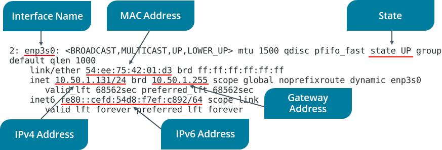
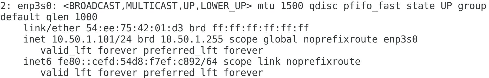
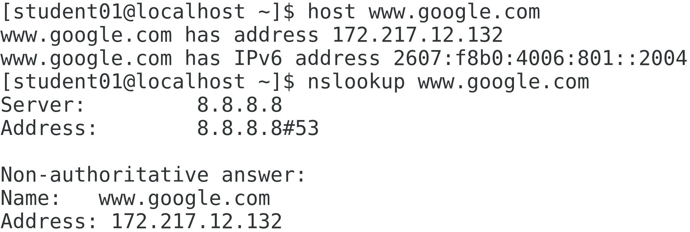
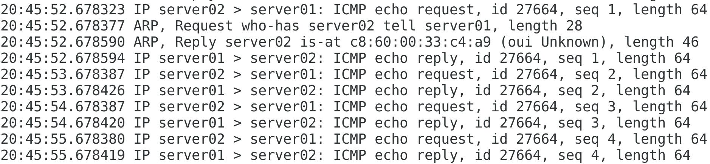

# 10: Managing Networking

## Configuring the Server's Network Identity

### Scenario

```text
You need to ensure the system's hostname and IP address configuration is correct. You also need to be able to configure network settings whether or not a GUI is installed. You will configure the system with both a static IP address and a dynamic IP address.
```

> Objectives

---

```text
Completing this activity will help you to use content examples from the following syllabus objectives:
   1.3 Given a scenario, configure and verify network connection parameters
   2.7 Explain the use and operation of Linux devices
```

1. Set the server's hostname
   - Log in as `student01` with `Pa22w0rd` as the password.
   - In a terminal window, enter `hostname` to view the system's current `hostname.`
   - Enter `nmcli general hostname` to use a different command to view the system's current `hostname`.
   - Enter `sudo hostnamectl set-hostname server01` to configure a new hostname.
   - Enter `sudo systemctl restart systemd-hostnamed` to restart the service, making the change persistent.
     - Recall that you will almost always have to restart services for changes to be implemented.
   - Verify that your system's `hostname` has changed.
2. Verify the current IP address configuration of the server
   - Enter `man ifconfig` and note the man page entry that indicates the tool is deprecated (retired).
   - Press `q` to quit.
   - Type `ip` (don't press Enter), add a `space`, then press `Tab` twice to see a list of available subcommands.
     - Be sure to include a space before pressing `Tab` twice. This tip takes advantage of tab completion. It displays the subcommands associated with the `ip` command.
   - Enter `ip addr` to display information about available network interfaces.
   - On `CentOS 7`, the main Ethernet device you should use will usually be named in the format `ens##` or `enp#s#`. For the following steps, make sure you're using the **Ethernet interface** identified with this name, and not the **loopback adapter** or a _wireless LAN adapter_.
   - Enter the interface name in the following text box - make sure you record the interface name, such as `ens32`, not the `IP or MAC address`:
   - Enter `ip addr show <devID>` to display the information for a specific interface.
   - 
     - If there is an error, make sure you are using the interface name from the output of the previous step. For example, the interface name value might be `ens32`
     - One of the first steps in networking troubleshooting is to verify the current IP address configuration. Therefore, the ip command will be essential to your network troubleshooting process.
3. Display network information by using `nmcli`
   - Enter `nmcli general status` to view the current network connectivity status according to `NetworkManager`.
   - Enter `nmcli` connection show to see the `connection name, UUID, type, and device ID` for each interface.
     - On this host, the connection name and device ID are identical. It is possible to configure different connection profiles that use the same device (`NIC`). For example, you could create a static IP connection profile and one that uses DHCP and switch between them as needed.
4. Disable and enable a `NIC` using `nmcli`
   - Enter `nmcli con down <devID>` to stop the interface, making it inactive.
   - Enter `nmcli device status` to view the current status.
   - Enter `nmcli con up <devID>` to re-enable the interface, making it active.
   - Enter `nmcli device status` to view the current status.
5. Configure the system with a static IP address using `nmcli`
   - Enter `ip addr show <devID>` to view the current IP address.
   - Enter `nmcli con edit <devID>` to edit the interface's IP address configuration.
   - Enter `set ipv4.addresses 10.50.1.101/24` to set the static IP address at the `nmcli` prompt.
   - Press `Enter` to set `ipv4.method` to manual
   - Enter `save at the nmcli prompt`.
   - Enter `quit at the nmcli prompt`.
   - Enter `nmcli con down <devID>`
   - Enter `nmcli con up <devID>` to reset the connection.
   - Enter `ip addr show <devID>` to confirm the static IP address is configured.
   - 
6. Configure the system as a DHCP client
   - Enter `nmtui` at the prompt to open a new interface.
     - Use the `Tab` key and the Arrow keys to navigate text-based user interfaces. Use the `Spacebar` to check/uncheck settings. Use the `Enter` key to accept a configuration.
   - Make sure _Edit a connection_ is highlighted, and then press `Enter`.
   - With the interface `<devID>` highlighted from the Ethernet menu, press the Right Arrow key once then the Down Arrow key to highlight < Edit…> and then press Enter.
   - Notice the static IP address, as configured in the previous task.
   - Press the `Tab` key three times to move to the `IPv4 CONFIGURATION line`.
   - That line currently displays `<Manual>`
   - Press `Enter` and select `Automatic` from the menu.
   - Press the `Tab` key multiple times until you reach the bottom of the interface and `< OK >` is highlighted.
   - Press `Enter` to save your changes to the network configuration.
   - Use the `Tab` key to highlight `< Back >` and then press `Enter`.
   - In the `NetworkManager TUI` interface, use the Down Arrow key to highlight `Quit` and then press `Enter`.
   - Enter `ip addr show <devID>` and notice that the old statically assigned IP address is still in place. This is because you need to restart the network service for changes to take effect.
   - Enter `sudo systemctl restart network`
   - Enter `ip addr show <devID>` and notice a new IP address is configured, leased from a DHCP server.
7. Using the GUI, reconfigure the NIC to use a `static IP address`
   - From the desktop menu, select `Applications→System Tools→Settings`.
   - In the `Settings` menu, select `Network`.
   - Notice the wired connection profile is displayed as `Connected` and `On`.
   - Select the `Configuration` gear button.
     - The `NIC` details may still show the `static IP address`.
   - Select the `Apply` button in the upper-right corner of the interface.
   - Select the `slider` to turn the `NIC Off`, then turn it back `On`.
   - Select the `Configuration` gear button again and note the `leased IP address`.
   - Select the `IPv4 tab`.
   - Observe that the Automatic (DHCP) button is selected, as configured in the previous nmtui task.
   - Select the Manual radio button, and then fill in the `Address`, `Netmask`, and `Gateway` fields:
     - `IP address: 10.50.1.101`
     - `Subnet mask: 255.255.255.0 or /24`
     - `Gateway: 10.50.1.1`
   - In the `DNS field`, enter `8.8.8.8`
   - This is one of **Google's DNS servers**.
   - Select `Apply`.
   - Select the slider to turn the connection `Off`, then turn it back `On`.
   - Close the `Settings` window.
   - Test the network configuration by opening `Applications→Favorites→Firefox Web Browser` and browsing to the <https://www.comptia.org> website.
   - When you're done, close the browser.

## Verifying Network Configurations

> Scenario

```text
Now that you've configured a NIC, you need to verify that those configurations are active and accurate. So, you'll use ethtool and the device's configuration file to confirm the networking details.
```

> Objectives

```text
- Completing this activity will help you to use content examples from the following syllabus objectives:
  - 1.3 Given a scenario, configure and verify network connection parameters
  - 2.7 Explain the use and operation of Linux devices
```

1. Gather information with ethtool
   - If necessary, enter `ip a` to recall your Ethernet device ID.
   - Enter `ethtool <devID>`
   - Verify that you can see information about the NIC's capabilities and configurations.
   - You should be able to see the NIC's maximum bandwidth speed, its duplex capabilities, its supported link modes, and more.
1. View network configuration files
   - Enter `ls /etc/sysconfig/network-scripts` to display the contents.
   - Verify that there is a `ifcfg-<devID>` file.
   - Enter `cat /etc/sysconfig/network-scripts/ifcfg-<devID>` to view the contents.
   - Verify that you can see device information as well as IP addressing information for this NIC.

## Configuring a DNS Client

### **Scenario**

```text
In addition to setting up machine-friendly IP addressing, you also need to account for the fact that humans aren't good at remembering long strings of numbers. So, you'll configure name resolution to relate a hostname with an IP address so that users can easily refer to a specific computer on the network.
```

### Objectives

```text
Completing this activity will help you to use content examples from the following syllabus objectives:
   1.3 Given a scenario, configure and verify network connection parameters
   2.7 Explain the use and operation of Linux devices
```

1. Review the IP address and hostname identities of your system
   - Enter `hostname` to view the system's user-friendly name.
   - Enter `ip addr show <devID>` to view the system's IP address.
     - Humans don't tend to be good at remembering long strings of numbers. Name resolution is used to relate the hostname and the IP address values displayed above.
   - If the leased IP address is still visible, use `nmcli con down <devID>` and then `nmcli con up <devID>` to reset the interface.
1. Try connecting to the second server by name and by IP address
   - Enter `ping server02` and verify that it fails.
   - Enter `ping 10.50.1.102` and verify that it succeeds.
   - Press `Ctrl+C` to interrupt the process.
     - One effective way of testing name resolution is to ping a destination host by name. If that fails, then ping the same host by IP address. If that succeeds, then you know that you have a good network connection to the destination, but that name resolution is failing.
1. Configure the server name for your second server
   - Select `CentOS 7 (2nd)` to access your second virtual machine.
   - Log in as `student02` with `Pa22w0rd` as the password.
   - In a terminal window, enter `sudo hostnamectl set-hostname server02` to configure a new hostname.
   - Enter `sudo systemctl restart systemd-hostnamed` to restart the service, making the change persistent.
   - Verify that your second system's hostname has changed by using the hostname command.
1. Configure name resolution for your system
   - Select `CentOS 7` to return to `server01`. If necessary, use `Pa22w0rd` to sign back in.
   - Enter `cat /etc/resolv.conf` to display the DNS server(s) the system is configured to query.
     - Note the spelling of the file name: `resolv.conf`
   - Enter `cat /etc/hosts` to display the static text file that can be used for name resolution.
   - Using `sudo`, open the text editor of your choice to add your second server's hostname and IP address information into the `/etc/hosts` file in the format: `10.50.1.102 server02`
   - Save and close the file.
   - Ping your second server's hostname and IP address again and verify that, this time, both succeed.
1. Ensure name resolution for Internet identities is functioning correctly
   - Enter `host www.google.com`
   - Enter `nslookup www.google.com`
   - Verify that you receive IP addressing results for google.com with each command.
   - 

## Configuring Virtualization

### Scenario

```text
One of the developers at Develetech has asked for your help. She needs Linux test environments to test that her application functions as designed. She'd like to manage the environments herself and be able to revert back to their original configuration for each test. You will install a KVM virtualization solution for her.
```

### Objectives

```text
Completing this activity will help you to use content examples from the following syllabus objectives:
    1.5 Compare and contrast cloud and virtualization concepts and technologies
```

1. What are some of the potential benefits of virtualization? Click here for answer.

      ```text
      Answers will vary. Virtualization can enable easy-to-revert environments; enable more efficient use of hardware; support on-demand availability; support quick starting and stopping of environments; offer better support for disaster recovery; and more.
      ```

1. Install the KVM virtualization software
   - Enter `cat /proc/cpuinfo | grep vmx` and then enter `cat /proc/cpuinfo | grep svm` to check the processor. If either term is found, the processor should support hardware-assisted virtualization.
   - Carefully enter the following command on one line. Check your syntax before you hit Enter:

   ```bash
   sudo yum -y install qemu-kvm qemu-img virt-manager libvirt libvirt-python libvirt-client virt-install virt-viewer bridge-utils librbd1 librbd1-devel libsolv
   ```

   - This installs `KVM` and dependent software.
   - Wait for `KVM` to finish installing.
   - Start the `KVM` service
   - Enter `sudo systemctl start libvirtd` to start the service.
   - The name of the KVM service is `libvirtd`
   - Enter `sudo systemctl enable libvirtd` to make the service persist.
   - Enter `lsmod | grep kvm` and verify that the KVM kernel module is loaded.
   - Create a VM at the CLI
   - Carefully enter the following command on one line. Check your syntax before you hit Enter:

   ```sh
   sudo virt-install --name=devtech-install --vcpus=1 --memory=2048 --cdrom=/opt/linuxplus/managing_networking/CentOS-7-x86_64-DVD-1810.iso --disk size=12 --os-variant=rhel7
   ```

   - This defines the hardware specifications of the virtual machine to create. The VM will use one virtual CPU, have access to 2 GB of RAM, use the provided system image to boot from, and have access to a 12 GB storage drive.
   - Close the `devtech-install(1) - VirtViewer` window that pops up and select OK when prompted.
   - Enter `sudo virsh save devtech-install saved-vm` to stop the VM and save its state for later.
1. Import a VM image using the GUI Virtual Machine Manager
   - From the desktop menu, select `Applications→System Tools→Virtual Machine Manager.`
   - Enter the `root` password to continue.
   - In the `Virtual Machine Manager`, select `File→New Virtual Machine`.
   - In the `New VM wizard`, for the first step, select `Import existing disk image`, then select `Forward`.
   - For the second step, select `Browse` and then select `Browse Local`.
   - From the navigation menu, select `+ Other Locations`.
   - Select `Computer`.
   - Navigate to `/opt/linuxplus/managing_networking` and open `ubuntu-vm.qcow2`.
   - Select `Forward`.
   - For the third step, change the Memory (RAM) to `2048` and ensure CPUs is set at `1`.
   - Select `Forward`.
   - For the fourth step, name the VM `ubuntu-vm` and select `Finish`.

1. Get acquainted with Ubuntu, a different distribution of Linux
   - Verify that a virtual machine window named `ubuntu-vm` on `QEMU/KVM` automatically pops up.
   - Wait for the authentication screen (it may take 1-2 minutes).
   - Log in to the Ubuntu virtual machine using `student` as the account and `Pa22w0rd` as the password.
   - Verify that you successfully signed in to the Ubuntu desktop.
   - If you receive an error that there is no space left on the device, reboot CentOS and try again.
   - From the bottom-left corner, select the `Show Applications` button . You might need to scroll the VM window down to locate this button.
   - If at any time you're prompted by the `Software Updater dialog box,` select `Remind Me Later`.
   - Select the `Settings` icon.
   - In the `Settings` window, from the navigation menu, select `Network`.
   - Select the `configuration gear icon` for the `Wired` connection to view the `Ubuntu VM's networking information`.
   - Select `Cancel` to close the `Wired` window, then close the `Settings` window.
   - From the `Show Applications` menu, select the `Utilities` icon.
   - Select the `Logs` icon.
   - Observe the log files that are displayed (it may take 1-2 minutes), then close the Logs window when you're done.
   - From the dock on the left side of the desktop, select the `Ubuntu Software` icon.
   - At the top of the window, select the `Installed` tab.
   - Scroll down and verify that Vim is installed, then close the window when you're done.
   - Shut down the virtual machine
   - Close the virtual machine window.
   - Right-click the `ubuntu-vm VM` and select `Shut Down→Shut Down`.
   - You may need to issue the shut down command twice.
   - Wait for the VM's state to change to `Shutoff`.
   - Close `Virtual Machine Manager`.

## Testing the Network Environment

### Scenario

```text
You want to use some of the Linux network troubleshooting utilities so that you can better understand the Develetech network environment. These will help you diagnose and solve issues related to latency, lack of hostname resolution, inability to connect to other hosts, and more.
```

### Objectives

```text
Completing this activity will help you to use content examples from the following syllabus objectives:
   1.3 Given a scenario, configure and verify network connection parameters
   2.7 Explain the use and operation of Linux devices
```

1. View network services that are currently listening on the hosts in your network.
   - Enter `ip addr` to verify the system has a correct IP address configuration.
   - When troubleshooting, an IP address that begins with `169.254` indicates the client could not lease an IP address from a DHCP server. The `169.254.0.0` IP address range is known as the Automatic Private IP Address (`APIPA`) range.
   - Enter `ss -l | less` to see what TCP ports your system is currently listening on, then press `q` to return to the prompt.
   - Enter `nc localhost 21`
   - You should receive a "`Connection refused`" error, indicating that your system is not listening on `port 21 (FTP)`.
   - Enter `nc server02 22` to verify that the second lab VM is listening on `port 22 (SSH)`.
   - Press `Ctrl+C` to disconnect.
   - You can use a tool like `nc` to identify network services that aren't listening on the local or remote host.
1. Test public name resolution
   - Enter `host www.comptia.org` at the command prompt.
   - Verify that you resolved the public CompTIA hostname to a specific IP address.
   - You can use a name resolution tool like host to ensure that you can establish a connection to hosts using human-friendly hostnames.
1. Capture network traffic
   - Enter `sudo tcpdump -i <devID>` where device ID is your Ethernet device name.
   - Verify that the `tcpdump tool` is listening on the device.
   - Right-click the desktop and select `Open Terminal` to open another terminal.
   - In this new terminal, enter `ping server02 -c 4`
   - In the other terminal window, verify that `tcpdump` captured the `ICMP echo traffic.`
   - You can use a network capture tool like `tcpdump` to learn more about the traffic that is transmitted and received over your network.
   - 
   - Close the terminal window running the tcpdump capture.
