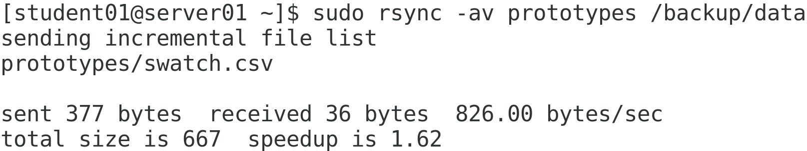
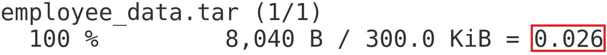
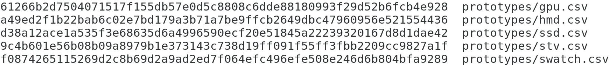
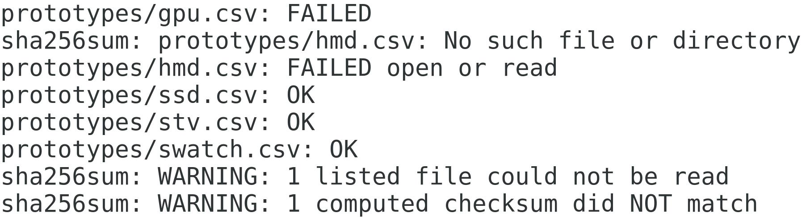

# Securing Linux Systems

## Encrypting a Volume

> Scenario

```text
The data you'll be backing up to your various logical volumes is sensitive in nature and should not be readable if it were to fall into the wrong hands. To protect the confidentiality of your backed up data, you'll encrypt the volumes that hold this data. You'll start with the databk volume. Without the correct key (e.g., a passphrase), a user will only see the scrambled ciphertext of this volume, and will be unable to read the plaintext data of individual files.
```

> Objectives

---

Completing this activity will help you to use content examples from the following syllabus objectives:
3.3 Summarize security best practices in a Linux environment

1. Prepare the data backup volume for encryption
   + Log in as `student01` with `Pa22w0rd` as the password.
   + In a terminal window, enter `sudo umount /backup/data`
   + Enter `sudo shred -v --iterations=1 /dev/backup/databk`
   + This will overwrite the contents of the volume to securely wipe any existing data. This is a good practice to ensure that no sensitive data remains before you prepare the encrypted volume.
   + Verify that the `shred` command finishes successfully.

2. Encrypt the data backup volume with a passphrase
   + Enter `sudo cryptsetup -v --verify-passphrase luksFormat /dev/backup/databk`
   + Enter `YES` when prompted to confirm.
   + When prompted for a passphrase, enter `linuxplus`
   + Verify the passphrase.
   + Verify that the command was successful.

3. Open the encrypted volume and verify that it is listed
   + Enter `sudo cryptsetup luksOpen /dev/backup/databk databk`
   + Enter `linuxplus` as the passphrase.
   + Verify that you are returned to a prompt without errors.
   + Enter `ls -l /dev/mapper | grep databk`
   + Verify that the encrypted volume is listed.

4. Format the volume, mount it, and create a file
   + Enter `sudo mkfs.ext4 /dev/mapper/databk`
   + Verify that the file system was written.
   + Enter `sudo mount /dev/mapper/databk /backup/data`
   + Enter `echo "Encrypted" | sudo tee /backup/data/encrypt.txt`

5. Add the encrypted volume to the `/etc/crypttab` and `/etc/fstab` files
   + Enter `sudo bash -c "echo databk /dev/backup/databk none >> /etc/crypttab"`
   + Enter `sudo cat /etc/crypttab` and confirm that the line was added.
   + 
   + This file is similar to `/etc/fstab` and initializes encrypted storage devices at boot.
   + Using `sudo`, open the `/etc/fstab` file in your text editor of choice.
   + Edit the line that mounts the `/dev/backup/databk` volume to say the following:
   + `/dev/mapper/databk /backup/data ext4 nofail 0 0`
   + This will mount the encrypted volume after it has been unlocked. The `nofail` option indicates that the system should not report any errors if the volume is not detected.
   + Save and close the file.

6. Reboot the machine and unlock the encrypted volume
   + Enter `systemctl reboot -i`
   + Verify that, rather than the normal sign in screen, you are prompted to unlock the encrypted volume with your passphrase.
   + Enter `linuxplus`
   + Sign in as your student account.
   + Using your preferred method, open the `/backup/data/encrypt.txt` file and verify you can read its plaintext contents.
   + Enter `sudo bash -c "echo > /etc/crypttab"`
   + You're clearing this file so you won't be prompted to unlock the volume every time you reboot. You can still unlock the volume manually after you've booted into the OS.
   + Encrypting a volume in this way requires physical access to the computer in order to unlock it and complete the boot process. You won't be able to SSH into the system to unlock it.

## Configuring SSH Authentication Using a Key Pair

> Scenario

---

```text
You want to enable your fellow administrators to remotely access servers that are physically located elsewhere. By default, the servers are already set up to accept encrypted SSH connections. Recently, however, Develetech has been the victim of several brute force password cracking attempts. Attackers have tried to gain remote access by running through various combinations of passwords. To minimize the risk of these attacks, you decide to change the authentication method that administrators will use to connect remotely. You'll have them each generate a cryptographic key pair that they'll use to prove their identities. Anyone without the key will be denied access. You'll also disable password authentication on the servers to mitigate brute force attacks.
```

> Objectives

---

> Completing this activity will help you to use content examples from the following syllabus objectives:
    > 2.5 Summarize and explain server roles</br>
    > 3.2 Given a scenario, configure and implement appropriate access and authentication methods</br>
    > 3.3 Summarize security best practices in a Linux environment</br>

1. Generate a public and private key pair to use with SSH authentication
   + Enter `ssh-keygen` to generate a key pair.
   + Press `Enter` to accept the default path in which to save the key.
   + Enter `linuxplus` as the `passphrase`.
   + You don't need to protect a private key with a `passphrase`, but doing so adds a second factor to the authentication process, and is recommended. The `passphrase` will decrypt the private key before it is used to solve the server's encrypted challenge.
   + Enter the `passphrase` again.

2. Verify that the keys were generated and saved to the home directory
   + Enter `cat .ssh/id_rsa` and examine the (encrypted) private key.
   + This is the key you'll use to validate the SSH server's encrypted challenge.
   + Enter `cat .ssh/id_rsa.pub` and examine the public key.
   + The server needs to install this public key once. The server will use this public key to verify the authenticity of the private key.

3. Copy your public key to your second server
   + Enter `ssh-copy-id student02@server02` to copy your public key to `server02`.
   + Enter `yes` to accept the authenticity of your second server.
   + When prompted for a password, enter `Pa22w0rd`

4. Verify that your public key was added to your second server
   + Select  and log in as `student02`.
   + Enter `cat .ssh/authorized_keys` and verify that your key was added.
   + Any public keys added to this file are considered authorized and will be used in SSH authentication. If you wanted to authenticate other users, you could have them generate a unique key pair and then add their public key to this file as well.

5. Authenticate with your second server's SSH server using your private key
   + Select `CentOS 7` to return to `server01`.
   + Enter `ssh student02@server02`
   + When prompted, type *(but don't press Enter)* `linuxplus` as the passphrase to unlock your private key.
   + Check the `Automatically unlock this key whenever I'm logged in` check box.
   + Select `Unlock`.
   + Verify that you are signed in to `server02` as the `student02` account.
   + If you get an `"Authentication failed"` message, enter the `ssh` command again.
   + You've successfully authenticated to the *second SSH server*.

6. For added security, disable password authentication
   + Enter `exit` to close your SSH session and return to your local login on `server01`.
   + Switch back to the `CentOS 7 (2nd) virtual machine`.
   + Using `sudo`, open the `/etc/ssh/sshd_config` file in your desired text editor.
   + Scroll down until you get to the `PasswordAuthentication yes` line.
   + Change `yes` to `no` and then `save and quit` the file.
   + Enter `sudo systemctl restart sshd`
   + Switch back to `CentOS 7`
   + Enter `ssh ariley@server02`
   + You have no private key for this account, and the server isn't accepting passwords.

## Configuring SELinux

> Scenario

---

```text
The Apache web server you installed is serving its purpose, but the team would like to organize the server's files in a more descriptive way than the default `/var/www/html` directory. Also, the system will eventually run multiple web apps, each in a different path. For now, you need to place all of the web server files in a new `/var/develweb` directory. Even though you apply the correct standard permissions and configure Apache to allow access, `SELinux` will prevent the `httpd service` from reading files in this new directory. So, you'll configure`SELinux` as needed to make sure the web server is operational
```

### Objectives

> Completing this activity will help you to use content examples from the following syllabus objectives:
   > 3.1 Given a scenario, apply or acquire the appropriate users and/or group permissions and ownership</br>
   > 4.3 Given a scenario, analyze and troubleshoot user issues</br>
   > 4.4 Given a scenario, analyze and troubleshoot application and hardware issues</br>

1. Check the status of `SELinux`
   + Enter sestatus to display the current status of `SELinux`.
   + Verify that `SELinux` is enabled and in enforcing mode.

2. Create a new directory to hold the web server files
   + Enter `sudo mkdir /var/develweb`
   + Enter `sudo bash -c "echo This is a test > /var/develweb/test.html"`
   + Enter `ls -al /var/develweb`
   + Verify that all users have read and execute permissions to this directory, and that all users have at least read permissions to the file you just created.

3. Configure Apache settings to use the new path as the document root and enable access
   + Using `sudo`, open the `/etc/httpd/conf/httpd.conf` in the text editor of your choice.
   + Enter `/DocumentRoot` to search for the appropriate field.
   + Change this field to the following:
   + `DocumentRoot "/var/develweb"`
   + Below this, look for the `< Directory "/var/www">` line and change it to the following:
   + `< Directory "/var/develweb">`
   + There is not a space between `<` and `D`
   + Save and quit the file.
   + Enter `sudo systemctl restart httpd`

4. Attempt to view the web page, and troubleshoot any issues
   + From the desktop menu, select `Applications→Favorites→Firefox Web Browser`.
   + Navigate to <http://127.0.0.1/test.html>
   + Verify that you are presented with a `Forbidden message`.
   + The message elaborates by saying you don't have permission to access the HTML file.
   + An `SELinux alert` will also pop up on the desktop, but will be minimized after a few seconds. The alert may be accessed by selecting the icon that appears to the left of the clock in the taskbar.
   + If the `SELinux alert` is still open, hover over it and select `Show`. If the alert disappears, select the icon to the left of the clock to open the same `SELinux Alert Browser dialog box`.
   + Select `Troubleshoot.`
   + Under `If you were trying to`, select the first option.
   + Verify that the proposed solution involves changing the context label on the new directory path.
   + The troubleshooter mentions many possible file types, but there is a way to narrow down which one you need to use.
   + Close this dialog box.

5. Verify the required SELinux context and the current one applied to the new path
   + At a terminal, enter `ls -Z /var/www`
   + Retrieving `SELinux` context information from the default document root should provide you with what you need.
   + Verify that the "type" context for the html directory is `httpd_sys_content_t`
   + This is the context you need to apply to your new directory to allow Apache to access the files.
   + Enter `ls -aZ /var/develweb` and verify that the "type" context for your new directory is `var_t`
   + This new directory inherited the default context of its container directory `(/var)`.

6. Apply the appropriate context to the new web server directory
   + Enter `sudo semanage fcontext -a -t httpd_sys_content_t "/var/develweb(/.\*)?"`
   + This adds the provided context for the `/var/develweb` directory. The symbols at the end use a regular expression to apply this context to all subdirectories and files within this directory.
   + Enter `ls -aZ /var/develweb` and verify that the directory still doesn't have the correct context.
   + Enter `sudo restorecon -Rv /var/develweb`
   + Check the directory's contexts again and verify that it now shows `httpd_sys_content_t`

7. Confirm that you can now access the web page.
   + Switch back to `Firefox` and refresh the page.
   + Verify that the test page is displayed.
   + Close the browser.

# Configuring a Firewall

> Scenario

---

Your fellow network administrators have designed a `DMZ` in which you'll need to place several public-facing Linux systems. For the most part, these systems function as web servers, and need to allow users to connect using the `HTTP` and `HTTPS` protocols. The servers are also running a custom app that the development team has programmed to accept connections on `port 7743`. So, your job is to tighten the network security of the servers without denying access to the necessary services. You'll do this by configuring the `firewalld` service, the default and preferred firewall service on `CentOS 7`

> Objectives

+ Completing this activity will help you to use content examples from the following syllabus objectives:
  + 3.5 Given a scenario, implement and configure Linux firewalls
  + 4.4 Given a scenario, analyze and troubleshoot application and hardware issues

1. Test the firewall to see if it's blocking a well-known port
   + Switch to `CentOS 7 (2nd)`
   + Enter `systemctl status firewalld`
   + Confirm that the service is currently active and running.
   + If it isn't, enter `sudo systemctl start firewalld`
   + Switch to `CentOS 7`
   + Enter `sudo /usr/local/bin/nmap -sV server02 -p 80`
   + Verify that `port 80/tcp` is listed as "filtered", meaning that a firewall is likely blocking traffic on this port.

2. Get more information about a specific zone
   + Switch to `CentOS 7 (2nd)`
   + Enter `firewall-cmd --get-zones` to get a list of all default zones.
   + Enter `sudo firewall-cmd --zone=dmz --list-all`
   + Verify that you see several details about this zone, including:
   + Its target. The target defines the behavior for incoming connections (i.e., accept, reject, or drop traffic). The default setting is to reject traffic not matching any rules.
   + What network interfaces this zone is currently applied to.
   + What services, ports, and protocols are applied to this zone. In this case, SSH is the only service that will accept incoming connections on interfaces that use this zone.
   + Additional rules for *port forwarding*, *blocking ICMP (ping)*, and more.
   + Enter `sudo firewall-cmd --get-active-zones`
   + Verify that, currently, your main Ethernet interface is using the public zone.

3. Set the `dmz zone` for your primary network interface
   + Enter `ip a` and note the device name of your primary Ethernet interface.
   + This is the interface that you configured in the networking lesson.
   + Enter `sudo firewall-cmd --zone=dmz --change-interface=ens32 --permanent`
   + Verify that the change was a success.

4. Add services and a custom port to the zone
   + Enter `sudo firewall-cmd --zone=dmz --add-service=http --permanent`
   + Enter `sudo firewall-cmd --zone=dmz --add-service=https --permanent`
   + You've just added `HTTP` and `HTTPS` as services that will apply to the dmz zone. In other words, traffic bound for these services will be allowed.
   + Enter `sudo firewall-cmd --zone=dmz --add-port=7743/tcp --permanent`
   + This adds a specific port instead of a defined service to the zone.

5. Verify that your configurations were applied to the zone
   + Enter `sudo firewall-cmd --reload`
   + Enter `sudo firewall-cmd --zone=dmz --list-all`
   + Verify the following about this zone:
   + It is being used by your main network interface.
   + The `SSH`, `HTTP`, and `HTTPS` services are active in the zone.
   + `TCP port 7743` is also active in the zone.

6. Test the firewall to see if your configurations are working as intended
   + Switch to `CentOS 7`
   + Enter `sudo /usr/local/bin/nmap -sV server02 -p 80`
   + Verify that the port is now "*closed*," indicating that the firewall permits traffic on this port, but there is not a service currently listening on this port.
   + Use the same `nmap` command to scan for `port 21 (FTP)`.
   + Verify that it is filtered, indicating that the firewall is blocking traffic on this port as expected.
   + Enter `ssh student02@server02`
   + Verify that you are able to make a connection, indicating that SSH traffic is allowed.
   + Enter `exit` to close the SSH session.
   + What is the Linux kernel framework that most firewall services rely on to some degree? Click here for the answer.
       + > Netfilter
   + In an iptables table, what is the function of a chain, and how do chains interact with one another? Click here for the answer.
       + > Chains are sets of rules that the table uses to implement firewall functionality. Chains enable a progression of how firewall rules are evaluated; traffic matching a rule in one chain can be passed to another chain, where it is evaluated against a new set of rules.

   + True or false? `IP forwarding` is most useful on systems with only one network interface. Click here for the answer.
       + > False

   + What are the differences between a firewall and an `intrusion prevention system (IPS)`? Click here for the answer.
       + > Answers may vary, but firewalls typically allow or deny traffic into and out of a network based on a set of predefined rules. An IPS evaluates traffic that has made it past the firewall and looks for a repeated pattern of anomalous or otherwise unwanted behavior. An IPS is therefore a second layer of defense. Firewalls can also apply to outgoing traffic, whereas IPSs tend to focus on just incoming traffic.

## Configuring rsyslog for Local and Remote Logging

> Scenario

---

```text
You want to ensure that your system is logging only messages that are useful to you and other analysts. So, you'll configure the local logging behavior to be more fine-tuned and less noisy. In addition, each system should be sending its authentication logs to a remote, centralized server for easy analysis and storage. So, you'll configure rsyslog to send these messages to a remote host over the network
```

> Objectives

+ Completing this activity will help you to use content examples from the following syllabus objectives:
  + 2.5 Summarize and explain server roles
  + 3.4 Given a scenario, implement logging services

1. Examine the default rules in the rsyslog configuration
   + On CentOS 7 using `sudo`, open the `/etc/rsyslog.conf` file in the text editor of your choice.
   + Scroll down to the `RULES section`.
   + Verify that, in the left column, each line lists one or more severities and/or facilities.
   + For example, the `authpriv._facility` refers to private authentication messages, such as login and logout events. The `asterisk (*)` indicates that all severities should be logged.
   + Verify that each line has a corresponding action in the right column.
   + For example, the `authpriv.*` facility will log its messages in the `/var/log/secure` file.

2. Filter the messages log to reduce the number of events it records
   + Locate the line that logs events to the `/var/log/messages file`. This line tells `rsyslogd` to log all events that are of `info level (6)` severity and above *(lower number is more severe)*. It makes exceptions for `mail messages`, `private authentication messages`, and `cron` messages (scheduler).
   + On this line, replace the `.info` text with `.notice`
   + The notice `severity (level 5)` logs normal but significant conditions. Now, the messages log will not record `informational messages (level 6)`, but start with `level 5` messages.
   + Leave the file open.

3. Configure your `server02` to receive `remote rsyslog messages over TCP`
   + On `CentOS 7 (2nd)` use `sudo` to open `/etc/rsyslog.conf` in the text editor of your choice.
   + Scroll to the `MODULES` section.
   + Find the line that says `# Provides TCP syslog reception`
   + Change the two lines below so that they read as follows:
   + `$ModLoad imtcp`
   + `$InputTCPServerRun 601`
   + Ensure there are no `#` symbols at the beginning of these lines.
   + Save your changes and close the file.
   + Enter `sudo systemctl restart rsyslog` to restart the service, causing it to reread the configuration file and implement your changes.

4. Configure the client to send `rsyslog` traffic to `server02`
   + Switch to the `CentOS 7 virtual machine`.
   + Scroll to the bottom of the `/etc/rsyslog.conf` file, and on a new line, type the following:
   + `authpriv.\* @@10.50.1.102:601`
   + Ensure there are no leading `#` symbols on this line.
   + The `@@` symbols indicate a `TCP` connection, whereas a single `@` indicates `UDP`.
   + Save and close the file.
   + Enter `sudo systemctl restart rsyslog` to restart the service, causing it to reread the configuration file and implement your changes.

5. Add an allow rule to the firewall for the `rsyslog` traffic
   + Switch to the `CentOS 7 (2nd) virtual machine`.
   + Enter `sudo firewall-cmd --zone=dmz --add-port=601/tcp --permanent`
   + Enter `sudo systemctl restart firewalld`

6. Generate an authentication failure message and confirm it was sent to your second server
   + Switch to the `CentOS 7 virtual machine`.
   + Enter `su - ariley`
   + Provide an incorrect password and verify that you failed to log in as this user. By entering the wrong password, you will generate a log file entry.
   + Switch to `CentOS 7 (2nd)`
   + Enter `sudo tail /var/log/secure | grep ariley`
   + Verify that you see an authentication failure message that was sent from your other server.

7. Turn off remote logging
   + Switch to `CentOS 7`
   + Using `sudo`, open the `/etc/rsyslog.conf` file in the text editor of your choice.
   + Scroll to the __bottom of the file__ and remove the entire `authpriv line`.
   + Save and close the file.

## Examining Log Files

> Scenario

---
```text
Up until now, you've examined a few logs using standard tools like cat and less, and also filtered those logs using a tool like grep. However, you can also use `journalctl` to more efficiently shape those log messages in order to extract the specific information you're looking for. You'll also use last and its associated commands to get an overview of login events, such as when a user last logged in
```
> Objectives

+ Completing this activity will help you to use content examples from the following syllabus objectives:
  + 2.5 Summarize and explain server roles
  + 3.4 Given a scenario, implement logging services

1. Use `journalctl` to retrieve and filter messages
   + Enter `sudo journalctl` and verify that you can page through many lines.
   + Press `q` to quit.
   + Enter `sudo journalctl -p` notice and verify that the log was filtered.
   + Only messages matching *severity level 5* appear.
   + Press `q` to quit.
   + Enter `sudo journalctl -p notice | grep kernel`
   + Verify that kernel messages are displayed.
   + These messages are similar to what you'd find in the `/var/log/messages` file.
   + Enter `sudo journalctl -f` to retrieve the most recent entries.
   + Press Ctrl+C to terminate the process.
   + Enter `sudo journalctl --since "2 hours ago" --until "30 minutes ago"`
   + Page through the results and verify that the first entry was two hours ago and that the last entry was 30 minutes ago.
   + Press `q` to quit.
   + Enter `sudo journalctl -u httpd.service`
   + Verify that the log is filtered by *__Apache service messages__*.
   + Press `q` to quit.

2. Use `last` and related commands to examine account login events
    Enter `last`
    Verify that you can see the login and logout events for various users.
    Enter `sudo lastb`
    Verify that you can see a list of user accounts and the times that an authentication attempt with that account failed.
    Enter `lastlog`
    Verify that you can see the last time that each user logged in.
    This log also indicates when an account has never logged in.

## Archiving and Restoring Files

> Scenario

---
```text
On a yearly basis, HR has been compiling information about Develetech employees and putting them in a spreadsheet. These spreadsheets contain personal information such as names, addresses, and phone numbers. You need to ensure that past years' reports are stored in backup should they ever need to be retrieved in the future. Because you won't need to regularly update these files, you decide to place them in a single archive. You also want to test the process of recovering the files from this archive if it's ever necessary
```
> Objectives

Completing this activity will help you to use content examples from the following syllabus objectives:
    3.6 Given a scenario, backup, restore, and compress files
   > If necessary, unlock the encrypted volume. Open the Files app, then select + Other Locations, then select the encrypted volume and input linuxplus as the passphrase.

1. Copy the employee data files to your home directory
   + Ensure you are in your home directory.
   + Enter `cp -r /opt/linuxplus/securing_linux_systems/employee_data employee_data`
   + Enter `ls -l` and verify that the directory was copied.

1. Archive the employee data files and then copy the archive to the data backup volume
   + Enter `tar -cvf employee_data.tar employee_data/_`
   + This creates a new archive with the specified name. The `asterisk (*)` indicates that all files within the employee_data directory should be added to the archive.
   + Enter `ls -l` and verify that the `.tar` file is present.
   + Enter `tar -tf employee_data.tar` to list the contents of the archive.
   + Enter `sudo cp employee_data.tar /backup/data/employee_data.tar`
   + Enter `ls -l /backup/data` and verify that the archive file is now on the data backup volume.

1. Restore all files from the archive, then restore a single file.
   + Enter `cd /backup/data` to change your current working directory.
   + Enter `sudo tar -xf /backup/data/employee_data.tar`
   + Enter `ls -l employee_data` and verify that all of the files were extracted to the directory.
   + Enter `sudo rm -r employee_data` to delete the directory.
   + Enter `sudo tar -xf employee_data.tar employee_data/emp_2018.csv`
   + Enter `ls -l employee_data` and verify that only the one file was extracted.
   + Enter sudo rm -r employee_data to delete the directory.

## Synchronizing Files

## Scenario

---

```text
The Research and Development (R&D) department also has sensitive data that they need backed up: data on product prototypes, including model numbers, pricing, and release dates. Unlike the employee data, these files are likely to be updated regularly. So, you want to make sure the backup copies consistently align with the source copies. You'll use rsync to synchronize both copies, ensuring that the backup copies will only need to be updated if the source files have changed
```

> Objectives

Completing this activity will help you to use content examples from the following syllabus objectives:
    2.3 Given a scenario, create, modify, and redirect files
    3.6 Given a scenario, backup, restore, and compress files

1. Copy the prototype product files to your home directory
   + Enter `cd ~` to return to your home directory.
   + Enter `cp -r /opt/linuxplus/securing_linux_systems/prototypes prototypes`
   + Enter `ls -l` and verify that the directory was copied.

1. Synchronize the prototype files with a directory on the backup volume
   + Enter `sudo rsync -av prototypes /backup/data`
   + In the output, verify that each file in the folder was copied, and that the command sent a specific number of bytes.
   + Enter `ls -l /backup/data` and verify that all files were copied.

1. Make a change to a file and resynchronize with the backup directory
   + Enter `echo -e "\nSW950,749.99,12/5" >> prototypes/swatch.csv` to make a change to one of the files.
   + Enter `sudo rsync -av prototypes /backup/data`
   + In the output, verify that the only file that was sent was the one that you changed.
   + 
   + Enter `cat /backup/data/prototypes/swatch.csv` and verify that your change was added to the backup version of the file.

## Compressing Files

> Scenario

---

As you archive more and more data, you realize that the archives take up just as much space as the files they hold. This is a waste of space, especially if you're not working with the archives' contents regularly. So, you'll compress the archives so that they take up significantly less space without losing any data. You'll also try several different compression algorithms and compare their performance

> Objectives

+ Completing this activity will help you to use content examples from the following syllabus objectives:
  + 2.3 Given a scenario, create, modify, and redirect files
  + 3.6 Given a scenario, backup, restore, and compress files

1. Note the size of the employee data archive on the backup volume
   + Enter `cd /backup/data`
   + Enter `ls -lh` and note the size of the `employee_data.tar` file that you created earlier.

1. Compress the archive with `gzip`
   + Enter `sudo bash -c "gzip -cv employee_data.tar > employee_data.tar.gz"`
   + Verify that the output indicates that the file was reduced by over 90% of its original size.
   + By default, `gzip` replaces the file with the compressed version. With this command, you are using the `-c` option with output redirection to keep the original .tar file intact.
    Enter `ls -lh` and confirm that `employee_data.tar.gz` is much smaller in size.

1. Decompress the archive
   + Enter `sudo tar -xzf employee_data.tar.gz`
   + Enter `ls -l employee_data` and verify that the individual files were extracted.
   + With the `-z` option, the tar command has the ability to use `gzip` to compress and decompress archives. You could use `gzip` to decompress the file and then `tar` to unarchive it, but this is faster.
   + Enter `sudo rm -r employee_data` to delete the directory.

1. Compress and decompress the archive with `xz`
   + Enter `sudo xz -kv employee_data.tar`
   + The `-k` option keeps the original file intact.
   + Verify that the output indicates that the compressed file is less than 5% the size of the original (expressed in decimal).
   + 
   + Enter `ls -lh` and verify that the `employee_data.tar.xz` file is even smaller than the `.gz` file.
   + Enter `sudo tar -xJf employee_data.tar.xz`
   + The `tar` command can also work with `.xz` files through the `-J` option. As before, this decompresses and unarchives the `.tar` archive all in one command.
   + Enter `ls -l employee_data` and verify that all of the files are there.
   + Enter `sudo rm -r employee_data` to delete the directory.

1. Compress and decompress the archive with bzip2
   + Enter `sudo bzip2 -kv employee_data.tar`
   + Verify that the output indicates that the file was reduced by over 90% of its original size.
   + Enter `ls -lh` and confirm that `employee_data.tar.bz2` is slightly larger than the `.gz` equivalent.
   + Enter `sudo tar -xjf employee_data.tar.bz2`
   + The `tar` command can also work with `.bz2` files through the `-j` option. As before, this decompresses and unarchives the `.tar` archive all in one command.
   + Enter `ls -l employee_data` and verify that all of the files are there.
   + Enter `sudo rm -r employee_data` to __delete__ the directory.

## Performing Integrity Checks on Files

> Scenario

---

The R&D team is concerned about unauthorized users tampering with the prototype data. There's also the possibility that the data will become corrupted in a non-obvious way, which will compromise the integrity of the data. So, in order to be confident that the data hasn't changed, you'll run the files through a hash function and compare those hashes to hashes captured at a different time. If the hash values are the same, you can be assured of the data's integrity. If not, you'll know something went wrong

> Objectives

Completing this activity will help you to use content examples from the following syllabus objectives:
    3.6 Given a scenario, backup, restore, and compress files

1. Create hashes of the prototype files
   + Enter `sudo bash -c "sha256sum prototypes/\* > hashes.txt"`
   + Enter `sudo cat hashes.txt`
   + Verify that the text file lists five different hash values, each one corresponding to a specific `.csv` file.
   + 

1. Compare the captured hashes to the hashes of the current files
   + Enter `sudo sha256sum -c hashes.txt`
   + Verify that the output indicates that all of the files are "`OK`".
   + In other words, `sha256sum` hashed the files, then compared those hashes to the list of hashes you generated in the previous step. The hashes are all identical, implying that the files haven't changed. In a production environment, you'd compare these hashes after some time had passed, after some potentially disruptive event, or right before resynchronizing.

1. Make changes to the files and verify that they fail the integrity check
   + Enter `sudo bash -c "echo GPU999 >> prototypes/gpu.csv"`
   + Enter `sudo rm prototypes/hmd.csv`
   + Enter `sudo sha256sum -c hashes.txt`
   + Verify that, this time, the integrity check failed on the file you modified, and that it could not find the file you deleted.
   + 
