# 13: Working with Bash Scripts

## Customizing the Bash Shell Environment

### Scenario

In order to enhance your productivity at the CLI, you decide to customize your Bash shell environment. For security reasons, you want to minimize the number of commands that are kept in the shell history, so you'll adjust the appropriate environment variable. You also plan on creating a directory to hold your future scripts, and in order to easily execute the scripts in that directory, you'll need to add it to your search paths. Lastly, as part of your auditing duties, you find yourself entering a rather lengthy command at the CLI every so often; this can get tedious, so you'll create a short alias for that command to make things easier.

> Objectives
> Completing this activity will help you to use content examples from the following syllabus objectives:
   > 5.1 Given a scenario, deploy and execute basic Bash scripts

1. Display the current environment variables
   - Log in as `student01` with `Pa22w0rd` as the password.
   - Open a terminal window.
   - Enter `env` to display environment variables.
   - Verify that the current environment variables and their values appear on the screen.
   - Verify that the `HISTSIZE` variable has a value of `1000`, indicating that a maximum of 1,000 of the most recently entered commands are stored in memory.

2. Reduce the maximum size of the command history by exporting its environment variable
   - Enter `echo $HISTSIZE` and verify that the variable has the expected value.
   - Enter `export HISTSIZE=5`
     - This is value is intentionally low to make it easier to demonstrate.
   - Enter more than five unique commands, one after another.
   - For example, you could enter `echo 1`, `echo 2`, etc.
   - Press the Up Arrow and verify that you can only return, at most, to the fifth-most recent command.
     - You can revert the history size if you prefer, or you can log out and it will revert automatically.

3. Create a directory that will hold scripts
   - Enter `sudo mkdir /scripts`
   - Enter `sudo cp /opt/linuxplus/working_with_bash_scripts/testscript.sh /scripts/testscript.sh`
   - Enter `testscript.sh`
   - Verify that the command was not found.
      - Bash is configured to check only certain directories for executable files, and because the `/scripts` directory is not one of the places it checks, it does not find your script.

4. Add `/scripts` as a search path to persist for the student account
   - Enter `echo $PATH` to display the directories that `Bash` does check for executable files.
   - Verify the current search paths that are set in this environment variable.
   - Ensure you are in your home directory. Enter `cd ~` to move to your home directory.
   - Open `.bash_profile` in the **text editor** of your choice.
   - Scroll to the last line of the file and change it to the following:
   - `export PATH=$PATH:/scripts`
     - Ensure you are appending /scripts to the`$PATH`variable, or you will overwrite the existing paths and be unable to easily enter many commands.
   - Save and close the file.

5. Test that the path works as intended
   - Enter `source .bash_profile` to reload your Bash profile and its variables.
   - Open a terminal and enter `echo $PATH` and verify that the new path was added to the end of the variable.
   - 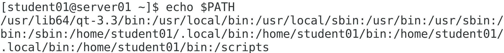
   - Enter `testscript.sh` and verify that the script executed successfully.

6. Create an alias for a lengthy command
   - Enter `lastlog | tail -n +2 | sort -k1`
   - Verify that the list is sorted by user name, rather than the default of last login time.
   - This is a somewhat cumbersome command to type over and over, so you'll create an alias to save time.
   - Open `.bashrc` in the text editor of your choice.
   - At the bottom of the file, on a new line, type the following:
   - `alias ulog='lastlog | tail -n +2 | sort -k1'`
   - Save and close the file.
   - Enter `source .bashrc`
   - Enter `ulog` and verify that it produced the expected results.

## Writing and Executing a Simple Bash Script

> Scenario

```text
As part of managing the many storage partitions and volumes on your Linux servers, you routinely run a command like df to see if any devices are getting close to full. By monitoring the storage space being used by each device, you can avoid problems before they happen. However, entering this command over and over again is somewhat tedious, and it doesn't immediately retrieve the most relevant information in the most useful format. You want to be able to generate a more readable "dashboard" report of what storage devices are getting close to full, and which are fine. So, you decide to automate the process by writing a script to do the work for you.
```

> Objectives
> Completing this activity will help you to use content examples from the following syllabus objectives:
> 5.1 Given a scenario, deploy and execute basic Bash scripts

1. Create the script file and give yourself the necessary permissions to execute it
   - Enter `sudo touch /scripts/check_storage.sh`
   - Enter `sudo chown student01 /scripts/check_storage.sh`
   - Enter `chmod 755 /scripts/check_storage.sh`
   - You're giving yourself full access and everyone else read and execute permissions.

2. Set up your script editing environment
   - From the desktop menu, select `Applications→Accessories→Text Editor`.
   - > You can write source code at the CLI, but it's often easier to write it in a visual editor, especially if you're new to programming/script writing.
   - Select `Open→Other Documents`.
   - Navigate to `/scripts` and open `check_storage.sh`.
   - On the bottom-right of the window, select the `Ln 1, Col 1` drop-down list.
   - Check the Display line numbers check box.

3. Begin the script by writing some contextual echo statements
   - On line 1, type `#!/bin/bash`
   - Press Enter twice to skip to line 3.
   - Type `echo "Beginning storage check…"`
   - On new lines 5 and 6, type the following:
   - `echo "Date: $(date)"`
   - `echo "------------------"`
   - The first line will simply echo the current date and time. It does this by leveraging the date command using command substitution. The second line just makes the formatting a little more visually pleasing; you don't need type an exact number of hyphens.
   - 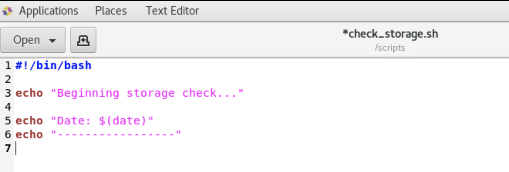

4. Assign the main variables the script will use
   - On a `new line 8`, type `part=/dev/sda1`
   - You're defining this variable so you can use it later as the name of the partition to check.
   - On a `new line 9`, type the following:
   - `checkper=$(df -h | grep $part | awk '{print $5}' | cut -d '%' -f1)`
   - There's quite a bit being assigned to this variable. The following is a breakdown:
     - First, the entire value is a command, so it uses the command substitution format, i.e., `$(…)`
     - The first subcommand uses `df` to get drive information.
     - This is piped to the `grep` command, which searches the results for anything matching the `$part` variable you just defined (in this case, `/dev/sda1).`
     - The `awk` command extracts the data in the fifth column of these results. If you issue`df -h` by itself, you can see that the fifth column details the percentage of the storage device that is being used.
     - Lastly, the cut command simply strips the percent sign (`%`) from the value so that the script can perform arithmetic on it.
     - The ultimate result is just a single number that represents the percentage of storage being used by the `/dev/sda1` partition.
   - 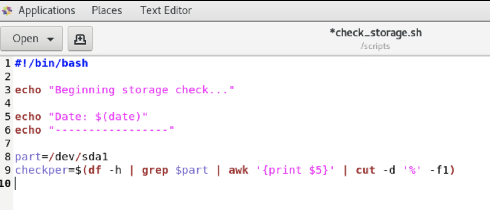

5. Write echo statements that report storage usage and indicate the check is complete
   - On a new line 11, type the following:
   - `echo "$part is $checkper% full."`
   - On a new line 13, type the following:
   - `echo "Storage check complete."`
   - Select `Save`.
   - 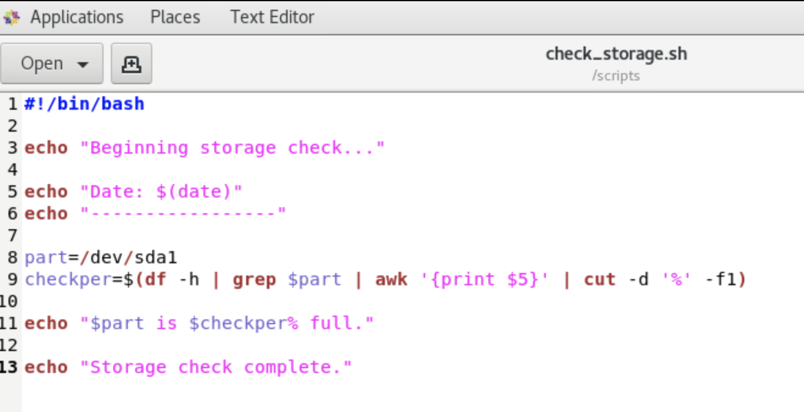

6. Test the script
   - Switch to a terminal, but keep the text editor open.
   - At the terminal, enter `check_storage.sh`
   - Verify that the output displays the date and time, the percentage full message, and the completion message.
   - 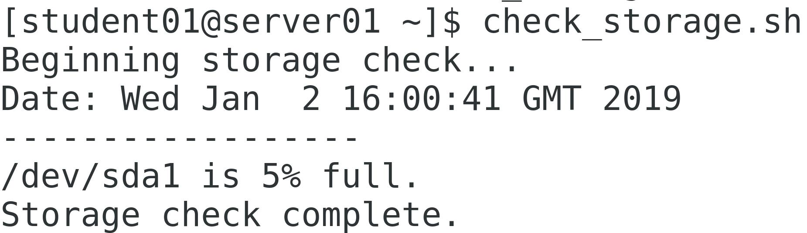

7. Redirect the pertinent output to a file instead of the CLI
   - Return to the text editor.
   - Place your cursor at the end of line 3 and press Enter twice.
   - On a new line 5, type the following:
   - `exec >> ~/storage_report.txt`
   - Now, all output in this script will be redirected to a file, unless otherwise specified.
   - Change the echo statement on line 15 so that it reads:
   - `echo "Storage check complete. Report saved to storage_report.txt." >&2`
   - This will redirect the message to the CLI (through `stderr`) in order to bypass the `exec` command.
   - Save the script.
   - [screenshot4](./Img/screenshot4.png)

8. Test the script again
   - From a terminal, run the script again.
   - Verify that the only messages printed to the CLI are the beginning and completion messages.
   - Enter `cat storage_report.txt` and verify that everything else was sent to this file.
   - 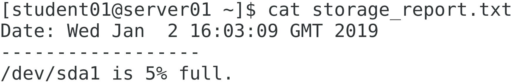
   - From a functionality perspective, how does this script fall short? How could it be improved? Click here for the answer.

## Incorporating Conditional Statements in Bash Scripts

> Scenario

```text
You want to make your script more useful to the administrators who will be receiving the reports. You can do this by enabling the script to make decisions based on various conditions. So, you'll use various if statements to output a different message for when the storage device meets certain thresholds of percentage full. Devices that are very close to full will trigger an urgent message, whereas those that are less full will trigger less urgent messages.
```

> Objectives
> Completing this activity will help you to use content examples from the following syllabus objectives:
> 5.1 Given a scenario, deploy and execute basic Bash scripts

1. Return to check_storage.sh in the text editor.
   - Place your cursor on the blank line 12 to start writing the first conditional branch.
   - Press `Enter`.
   - On a new line 13, type the following:
   - `if [ $checkper -ge 95 ] && [ $checkper -le 100 ]`
   - Press `Enter`.
   - On a new line 14, type `then`
   - Place your cursor at the beginning of line 15 and press `Spacebar` four times.
   - You're not required to indent or create whitespace, but it helps make the code more readable.
   - Modify the `echo` statement on line 15 to read like the following:
   - `echo "ALERT: $part is $checkper% full! Recommend immediate action!"`
   - You've just created the first if branch. This code checks to see if the percentage full value is greater than or equal to 95 and less than 100. If it is, then the script will `echo` an alert to the `storage_report.txt` file. However, you still need to write more branches to handle other conditions.

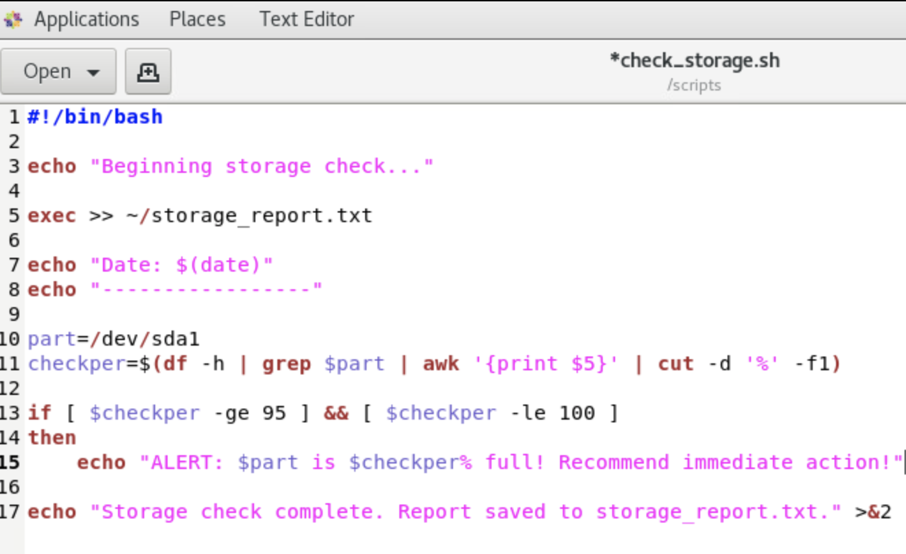

1. Write the next conditional branch

   - Place the cursor at the end of line 15 and press `Enter`.
   - On a new line 16, type the following:
   - `elif [ $checkper -ge 50 ] && [ $checkper -lt 95 ]`
   - Press `Enter`.
   - On a new line 17, type `then`
   - Press `Enter`.
   - On a new line 18, indent and then type the following:
   - `echo "CAUTION: $part is $checkper% full! Consider freeing up some space."`
   - If the previous condition is not met, the script will move on to evaluating the condition in this elif branch. The condition here checks to see if the percentage full is greater than or equal to 50 and less than 95. If it is, then a different message will be echoed to the report file.
   - 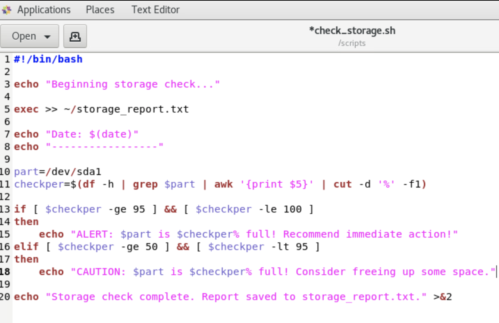

1. Finish writing the remaining conditional branches

   - Press Enter.
   - Starting on a new line 19, type the following code:

   ```bash
   elif [ $checkper -lt 50 ]
   then
   echo "$part is $checkper% full. No action needed."
   else
   echo "Encountered an error. Status code: $?" >&2
   exit $?
   fi
   ```

   - Indent lines 21, 23, and 24.
   - The next branch will output another message if the percentage full is less than 50. If none of these conditions are met (i.e., the percentage value is above 100 or it isn't a number), then the last else branch will throw an error. That exit code will be printed to the CLI and the script will terminate with this code.
   - Save the script.
   - 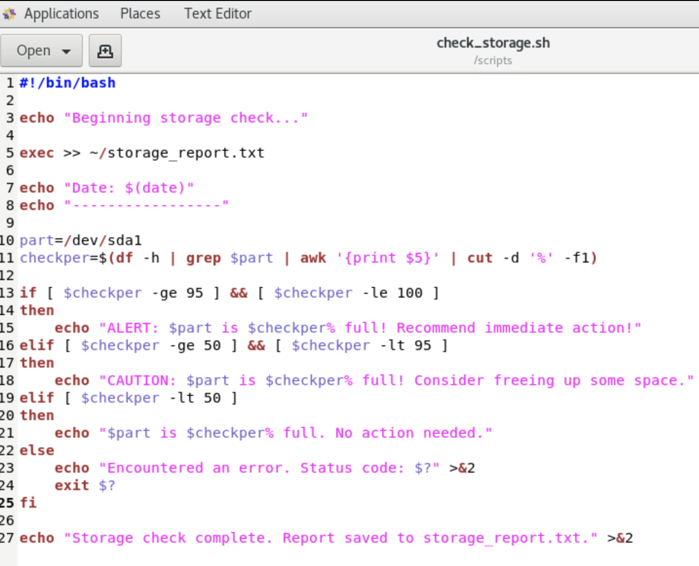

1. Test the script to see if the conditions work as expected
   - From a terminal, enter check_storage.sh
   - Enter `cat storage_report.txt` and verify that, because `/dev/sda1` is not very full, the report indicates that no action is needed.
   - 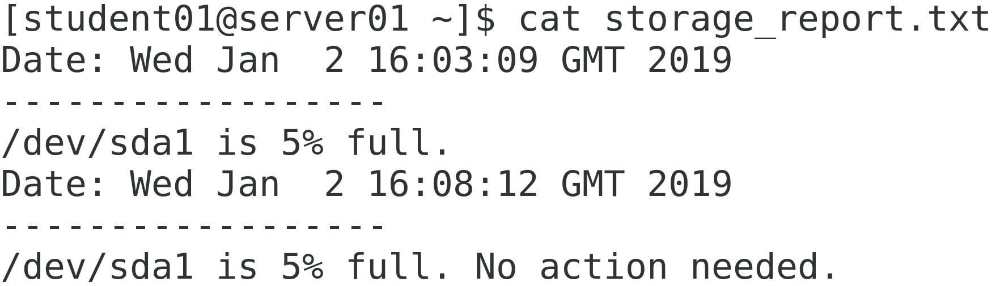
   - In other words, the script chose the correct action to take based on the conditions you set.
     - You'll test some of the other conditions in the next activity.

## Incorporating Loops in Bash Scripts

> Scenario

Your script is coming along, but it still needs improvement. You want to be able to output the status of all relevant storage partitions/volumes on the system, not just one or a few. You need a way to programmatically test your conditions for each device, rather than hardcode device names in your script—especially if the storage devices are likely to change. So, you'll leverage a for loop to iterate over each recognized storage device to perform the necessary checks.

> Objectives
> Completing this activity will help you to use content examples from the following syllabus objectives:
> 5.1 Given a scenario, deploy and execute basic Bash scripts

1. Adjust the part variable so that it holds an array of device names
   - Place your cursor on line 10 where the part variable is defined.
   - Change this line to the following:
   - `part=$(df -h | awk '{print $1}' | grep '/dev')`
   - This is similar to the checkper variable. The difference is, it will extract all text that is in the first column (device name), and then filter by devices that start with `/dev` to exclude temporary file systems. The part variable therefore becomes an array that holds all permanent storage device names on the system.
   - 

2. Insert a for loop that will iterate through the part array
   - Place your cursor at the end of line 10, then press Enter twice.
   - On a new line 12, type the following:
   - `for i in ${part[*]}`
   - This begins the for loop. The i variable is the iterator. The part variable is being referenced as an array, with the asterisk (\*) indicating all values in that array. For every index in the array (i.e., every device name), the script will execute what follows.
   - Press `Enter`, and on line 13, type `do`
   - This begins the code that the loop will execute on each iteration.
   - Place your cursor at the end of line 28 and press Ent`er.
   - On line 29, type `done`
   - This terminates the `for loop`. The conditional statements within this loop will be executed for each iteration.
   - 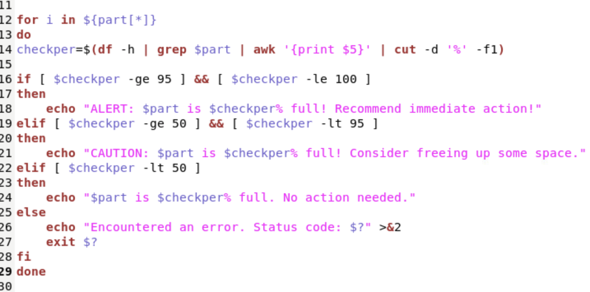

3. Change $part references to use the iterator instead
   - On line 14, change the `grep $part portion` of the command to `grep $i`
   - You need to get the information for each device individually. This means you need to reference the iterator, not the entire array.
   - On line 18, change the `$part` reference to `$i`
   - Do the same for lines 21 and 24.

4. Clean up the source code
   - Highlight all of lines 14 through 28.
   - Press Tab to indent the selected lines.
   - Save the file.
   - 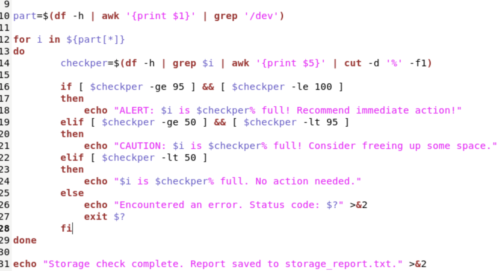

5. Test the script
   - From a terminal, enter `check_storage.sh`
   - Enter `cat storage_report.txt`
   - Verify that the report lists all storage devices and their appropriate warning messages.

6. Simulate a volume becoming full, then test the script again
   - At a terminal, enter `sudo dd if=/dev/zero of=/backup/sys/test bs=1M count=1100`
   - Verify that roughly 1.2 GB was copied to the volume.
   - Run your script again and read the report.
   - Verify that, this time, you receive a caution warning because the volume is past 50% full.
   - Enter `sudo dd if=/dev/zero of=/backup/sys/test2 bs=1M count=800`
      - The output file name and count have both changed.
   - Run the script again and view the report.
   - Verify that you received the most urgent message for the volume.
   - Close the text editor, but keep the terminal open.
